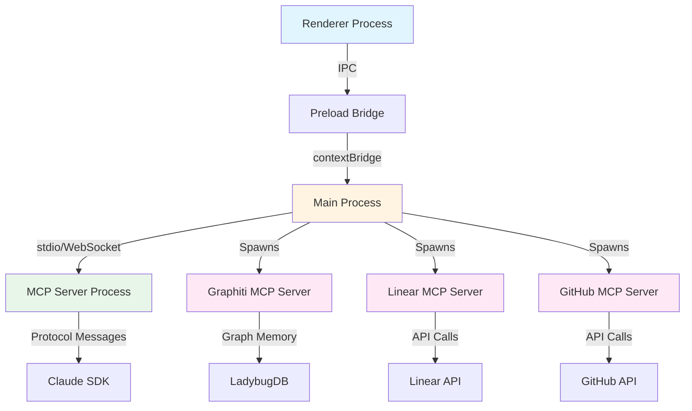

# End-to-End Testing Guide

> Comprehensive guide for testing the Auto-Claude Electron desktop application, including MCP server integration, IPC communication, and cross-platform scenarios.

---

## Table of Contents

- [Overview](#overview)
- [Testing Stack](#testing-stack)
- [Test Environment Setup](#test-environment-setup)
- [Electron MCP Server Testing](#electron-mcp-server-testing)
- [IPC Communication Testing](#ipc-communication-testing)
- [Integration Testing](#integration-testing)
- [Platform-Specific Testing](#platform-specific-testing)
- [CI/CD Integration](#cicd-integration)
- [Best Practices](#best-practices)
- [Troubleshooting](#troubleshooting)

---

## Overview

Auto-Claude's Electron desktop application requires comprehensive testing across multiple layers:

| Layer | Testing Focus | Tools |
|-------|---------------|-------|
| **Unit** | Individual components, utilities | Vitest |
| **Integration** | IPC communication, service integration | Vitest + Electron |
| **E2E** | Full user workflows, MCP server interaction | Playwright |
| **Platform** | Cross-platform compatibility | Platform-specific runners |

**Key Testing Challenges:**
- Electron's multi-process architecture (main, renderer, preload)
- MCP (Model Context Protocol) server communication
- Backend Python CLI integration via child processes
- Platform-specific behavior (Windows, macOS, Linux)
- Real-time WebSocket communication
- Claude SDK OAuth flow

---

## Testing Stack

### Frontend (Electron Desktop)

**Tech Stack:**
```json
{
  "runtime": "Electron 39.2.7",
  "nodeVersion": ">=24.0.0",
  "framework": "React 19.2.3",
  "buildTool": "electron-vite 5.0.0",
  "unitTesting": "Vitest 4.0.16",
  "e2eTesting": "Playwright 1.52.0",
  "testRuntime": "@playwright/test + electron"
}
```

**Test File Locations:**
```
apps/frontend/
├── src/
│   ├── main/
│   │   └── __tests__/           # Main process unit tests
│   ├── preload/
│   │   └── __tests__/           # Preload script unit tests
│   ├── renderer/
│   │   └── __tests__/           # Renderer process unit tests
│   └── shared/
│       └── __tests__/           # Shared utilities tests
├── e2e/
│   ├── setup.ts                 # E2E test setup
│   ├── fixtures/                # Test fixtures and helpers
│   ├── specs/
│   │   ├── basic.spec.ts        # Basic app functionality
│   │   ├── mcp-server.spec.ts   # MCP server integration
│   │   ├── ipc.spec.ts          # IPC communication
│   │   └── workflows.spec.ts    # Complete user workflows
│   └── playwright.config.ts     # Playwright configuration
├── vitest.config.ts             # Vitest configuration
└── playwright.config.ts         # E2E test configuration
```

---

## Test Environment Setup

### Prerequisites

```bash
# Required tools
node -v         # >=24.0.0
npm -v          # Latest

# Install dependencies
cd apps/frontend
npm install
```

### Configuration Files

**vitest.config.ts** (Unit/Integration Tests):
```typescript
import { defineConfig } from 'vitest/config'
import react from '@vitejs/plugin-react'
import path from 'path'

export default defineConfig({
  plugins: [react()],
  test: {
    globals: true,
    environment: 'happy-dom', // For renderer tests
    setupFiles: ['./src/__tests__/setup.ts'],
    coverage: {
      provider: 'v8',
      reporter: ['text', 'json', 'html'],
      exclude: [
        'node_modules/',
        'out/',
        'dist/',
        '**/*.spec.ts',
        '**/*.test.ts'
      ]
    }
  },
  resolve: {
    alias: {
      '@renderer': path.resolve(__dirname, './src/renderer'),
      '@main': path.resolve(__dirname, './src/main'),
      '@shared': path.resolve(__dirname, './src/shared'),
      '@preload': path.resolve(__dirname, './src/preload')
    }
  }
})
```

**playwright.config.ts** (E2E Tests):
```typescript
import { defineConfig, devices } from '@playwright/test'
import path from 'path'

export default defineConfig({
  testDir: './e2e',
  timeout: 30000,
  fullyParallel: false, // Electron apps can't run in parallel
  forbidOnly: !!process.env.CI,
  retries: process.env.CI ? 2 : 0,
  workers: 1, // Single worker for Electron
  reporter: [
    ['html'],
    ['junit', { outputFile: 'test-results/junit.xml' }]
  ],
  use: {
    trace: 'on-first-retry',
    screenshot: 'only-on-failure',
    video: 'retain-on-failure'
  },
  projects: [
    {
      name: 'electron',
      use: {
        ...devices['Desktop Chrome'],
        // Electron-specific configuration
        launchOptions: {
          executablePath: path.resolve(__dirname, './out/Auto-Claude-darwin-arm64/Auto-Claude.app/Contents/MacOS/Auto-Claude'),
          args: ['--remote-debugging-port=9222']
        }
      }
    }
  ]
})
```

### Running Tests

```bash
# Unit tests (Vitest)
npm test                    # Run all unit tests
npm run test:watch          # Watch mode
npm run test:coverage       # Generate coverage report

# E2E tests (Playwright)
npm run test:e2e            # Run E2E tests
npm run test:e2e:headed     # Run with visible browser
npm run test:e2e:debug      # Debug mode with Playwright Inspector

# Platform-specific E2E
npm run test:e2e:windows    # Windows-specific tests
npm run test:e2e:macos      # macOS-specific tests
npm run test:e2e:linux      # Linux-specific tests
```

---

## Electron MCP Server Testing

### What is MCP?

**MCP (Model Context Protocol)** is a protocol for AI model context management. In Auto-Claude:
- **Purpose**: Enables Claude agents to access project context, memory, and external tools
- **Architecture**: Electron app acts as MCP client, connecting to MCP servers (Graphiti memory, Linear, GitHub)
- **Communication**: IPC between Electron main process and MCP server processes

### MCP Server Architecture



### MCP Server Test Setup

**e2e/fixtures/mcp-server.ts**:
```typescript
import { test as base, expect, _electron as electron } from '@playwright/test'
import path from 'path'
import { ElectronApplication } from 'playwright'

export interface MCPServerFixtures {
  electronApp: ElectronApplication
  mcpServerReady: Promise<void>
  invokeMCP: (method: string, params?: any) => Promise<any>
}

export const test = base.extend<MCPServerFixtures>({
  electronApp: async ({ }, use) => {
    // Launch Electron app with MCP server enabled
    const app = await electron.launch({
      args: [path.resolve(__dirname, '../../out/main/index.js')],
      env: {
        ...process.env,
        GRAPHITI_ENABLED: 'true',
        MCP_SERVER_ENABLED: 'true',
        NODE_ENV: 'test'
      }
    })

    await use(app)
    await app.close()
  },

  mcpServerReady: async ({ electronApp }, use) => {
    // Wait for MCP server initialization
    const mainProcess = await electronApp.process()

    const ready = new Promise<void>((resolve) => {
      mainProcess.stdout?.on('data', (data) => {
        if (data.toString().includes('MCP server ready')) {
          resolve()
        }
      })
    })

    await use(ready)
  },

  invokeMCP: async ({ electronApp }, use) => {
    // Helper to invoke MCP methods via IPC
    const invoke = async (method: string, params?: any) => {
      return await electronApp.evaluate(
        ({ ipcMain }, { method, params }) => {
          return new Promise((resolve, reject) => {
            ipcMain.once('mcp-response', (event, response) => {
              if (response.error) reject(response.error)
              else resolve(response.result)
            })

            // Simulate IPC call from renderer
            ipcMain.emit('mcp-request', null, { method, params })
          })
        },
        { method, params }
      )
    }

    await use(invoke)
  }
})
```

### MCP Server Integration Tests

**e2e/specs/mcp-server.spec.ts**:
```typescript
import { test, expect } from '../fixtures/mcp-server'

test.describe('MCP Server Integration', () => {
  test('should initialize Graphiti MCP server on startup', async ({
    electronApp,
    mcpServerReady
  }) => {
    await mcpServerReady

    // Verify MCP server process is running
    const processes = await electronApp.evaluate(async ({ app }) => {
      const { mcpManager } = require('@main/services/mcp-manager')
      return mcpManager.getActiveServers()
    })

    expect(processes).toContainEqual(
      expect.objectContaining({
        name: 'graphiti',
        status: 'running'
      })
    )
  })

  test('should handle MCP server requests via IPC', async ({
    invokeMCP,
    mcpServerReady
  }) => {
    await mcpServerReady

    // Test memory search via Graphiti MCP
    const result = await invokeMCP('graphiti.search', {
      query: 'test query',
      limit: 5
    })

    expect(result).toHaveProperty('results')
    expect(Array.isArray(result.results)).toBe(true)
  })

  test('should handle MCP server connection failures gracefully', async ({
    electronApp
  }) => {
    // Kill MCP server process
    await electronApp.evaluate(async ({ app }) => {
      const { mcpManager } = require('@main/services/mcp-manager')
      await mcpManager.stopServer('graphiti')
    })

    // Attempt to use MCP should show error
    const window = await electronApp.firstWindow()

    // Try to search memory
    await window.getByRole('button', { name: /search memory/i }).click()

    // Should show error notification
    await expect(
      window.getByText(/MCP server not available/i)
    ).toBeVisible()
  })

  test('should restart MCP server on crash', async ({
    electronApp,
    mcpServerReady
  }) => {
    await mcpServerReady

    // Simulate MCP server crash
    await electronApp.evaluate(async ({ app }) => {
      const { mcpManager } = require('@main/services/mcp-manager')
      const server = mcpManager.getServer('graphiti')
      server.process.kill('SIGKILL')
    })

    // Wait for auto-restart (with timeout)
    await electronApp.waitForEvent('console', {
      predicate: (msg) => msg.text().includes('MCP server restarted'),
      timeout: 10000
    })

    // Verify server is running again
    const status = await electronApp.evaluate(async ({ app }) => {
      const { mcpManager } = require('@main/services/mcp-manager')
      return mcpManager.getServerStatus('graphiti')
    })

    expect(status).toBe('running')
  })

  test('should handle multiple MCP servers concurrently', async ({
    electronApp,
    invokeMCP,
    mcpServerReady
  }) => {
    await mcpServerReady

    // Start multiple MCP servers
    const servers = ['graphiti', 'linear', 'github']

    for (const server of servers) {
      await electronApp.evaluate(
        async ({ app }, serverName) => {
          const { mcpManager } = require('@main/services/mcp-manager')
          await mcpManager.startServer(serverName)
        },
        server
      )
    }

    // Verify all servers are running
    const activeServers = await electronApp.evaluate(async ({ app }) => {
      const { mcpManager } = require('@main/services/mcp-manager')
      return mcpManager.getActiveServers()
    })

    expect(activeServers).toHaveLength(servers.length)

    // Test concurrent requests
    const results = await Promise.all([
      invokeMCP('graphiti.search', { query: 'test1' }),
      invokeMCP('linear.getIssues', { limit: 10 }),
      invokeMCP('github.getRepos', { limit: 10 })
    ])

    expect(results).toHaveLength(3)
    results.forEach(result => {
      expect(result).toBeDefined()
      expect(result).not.toHaveProperty('error')
    })
  })
})

test.describe('MCP Protocol Compliance', () => {
  test('should send valid JSON-RPC 2.0 requests', async ({
    electronApp,
    mcpServerReady
  }) => {
    await mcpServerReady

    // Intercept MCP communication
    const messages: any[] = []

    await electronApp.evaluate(async ({ app }) => {
      const { mcpManager } = require('@main/services/mcp-manager')
      const server = mcpManager.getServer('graphiti')

      server.on('request', (msg: any) => {
        messages.push(msg)
      })
    })

    // Make MCP request
    await invokeMCP('graphiti.search', { query: 'test' })

    // Verify JSON-RPC 2.0 format
    const request = messages[0]
    expect(request).toMatchObject({
      jsonrpc: '2.0',
      id: expect.any(String),
      method: expect.stringContaining('search'),
      params: expect.any(Object)
    })
  })

  test('should handle MCP server errors with proper error codes', async ({
    invokeMCP,
    mcpServerReady
  }) => {
    await mcpServerReady

    // Request with invalid parameters
    await expect(
      invokeMCP('graphiti.search', { invalid: 'param' })
    ).rejects.toMatchObject({
      code: -32602, // Invalid params error code
      message: expect.stringContaining('invalid')
    })
  })
})

test.describe('MCP Server Lifecycle', () => {
  test('should start MCP servers before app ready', async ({ electronApp }) => {
    // This test verifies server startup order
    const startupLog = await electronApp.evaluate(async ({ app }) => {
      return globalThis.__mcpStartupLog || []
    })

    expect(startupLog).toContain('MCP manager initialized')
    expect(startupLog).toContain('Graphiti MCP server started')
  })

  test('should gracefully shutdown MCP servers on app quit', async ({
    electronApp,
    mcpServerReady
  }) => {
    await mcpServerReady

    // Close app
    await electronApp.close()

    // Verify cleanup (check process list on system)
    const { exec } = require('child_process')
    const { promisify } = require('util')
    const execAsync = promisify(exec)

    const { stdout } = await execAsync('ps aux | grep mcp-server || true')
    expect(stdout).not.toContain('graphiti-mcp')
  })
})
```

### MCP Communication Patterns

**Unit Test Example** (`src/main/services/__tests__/mcp-manager.test.ts`):
```typescript
import { describe, it, expect, beforeEach, afterEach, vi } from 'vitest'
import { MCPManager } from '../mcp-manager'
import { ChildProcess } from 'child_process'

describe('MCPManager', () => {
  let mcpManager: MCPManager

  beforeEach(() => {
    mcpManager = new MCPManager()
  })

  afterEach(async () => {
    await mcpManager.stopAllServers()
  })

  it('should start MCP server with correct arguments', async () => {
    const spawnSpy = vi.spyOn(require('child_process'), 'spawn')

    await mcpManager.startServer('graphiti', {
      host: 'localhost',
      port: 8001
    })

    expect(spawnSpy).toHaveBeenCalledWith(
      'node',
      expect.arrayContaining([
        expect.stringContaining('graphiti-mcp-server'),
        '--host', 'localhost',
        '--port', '8001'
      ]),
      expect.any(Object)
    )
  })

  it('should emit events on MCP server state changes', async () => {
    const stateChanges: string[] = []

    mcpManager.on('server-state-change', (event) => {
      stateChanges.push(`${event.server}:${event.state}`)
    })

    await mcpManager.startServer('graphiti')
    await mcpManager.stopServer('graphiti')

    expect(stateChanges).toEqual([
      'graphiti:starting',
      'graphiti:running',
      'graphiti:stopping',
      'graphiti:stopped'
    ])
  })

  it('should handle stdio communication with MCP server', async () => {
    await mcpManager.startServer('graphiti')

    const response = await mcpManager.request('graphiti', {
      jsonrpc: '2.0',
      id: '1',
      method: 'search',
      params: { query: 'test' }
    })

    expect(response).toMatchObject({
      jsonrpc: '2.0',
      id: '1',
      result: expect.any(Object)
    })
  })

  it('should timeout on unresponsive MCP server', async () => {
    await mcpManager.startServer('graphiti')

    // Mock unresponsive server
    vi.spyOn(mcpManager, 'sendRequest').mockImplementation(
      () => new Promise(() => {}) // Never resolves
    )

    await expect(
      mcpManager.request('graphiti', {
        jsonrpc: '2.0',
        id: '2',
        method: 'search',
        params: {}
      }, { timeout: 1000 })
    ).rejects.toThrow('MCP request timeout')
  })
})
```

---

## IPC Communication Testing

### IPC Architecture

Auto-Claude uses Electron's IPC for secure communication between processes:

```
Renderer Process (Untrusted)
       ↓ (window.electronAPI)
Preload Script (contextBridge)
       ↓ (ipcRenderer.invoke)
Main Process (Trusted)
       ↓ (ipcMain.handle)
Backend Services / MCP Servers
```

### IPC Security Testing

**e2e/specs/ipc.spec.ts**:
```typescript
import { test, expect } from '@playwright/test'
import { _electron as electron } from 'playwright'

test.describe('IPC Security', () => {
  test('should prevent renderer from accessing Node.js APIs', async () => {
    const app = await electron.launch({
      args: ['./out/main/index.js']
    })

    const window = await app.firstWindow()

    // Try to access Node.js APIs from renderer (should fail)
    const hasNodeAccess = await window.evaluate(() => {
      return typeof process !== 'undefined' &&
             typeof require !== 'undefined'
    })

    expect(hasNodeAccess).toBe(false)

    await app.close()
  })

  test('should only expose approved APIs via contextBridge', async () => {
    const app = await electron.launch({
      args: ['./out/main/index.js']
    })

    const window = await app.firstWindow()

    // Check available APIs
    const apis = await window.evaluate(() => {
      return Object.keys(window.electronAPI || {})
    })

    // Only these APIs should be exposed
    const allowedAPIs = [
      'invoke',
      'on',
      'off',
      'openExternal',
      'getAppVersion',
      'getPlatform'
    ]

    expect(apis).toEqual(expect.arrayContaining(allowedAPIs))
    expect(apis.length).toBe(allowedAPIs.length)

    await app.close()
  })

  test('should validate IPC channel names', async () => {
    const app = await electron.launch({
      args: ['./out/main/index.js']
    })

    const window = await app.firstWindow()

    // Try to invoke unauthorized channel
    const result = await window.evaluate(async () => {
      try {
        await window.electronAPI.invoke('unauthorized-channel', {})
        return { success: true }
      } catch (error) {
        return { success: false, error: error.message }
      }
    })

    expect(result.success).toBe(false)
    expect(result.error).toContain('Invalid channel')

    await app.close()
  })
})

test.describe('IPC Communication Patterns', () => {
  test('should handle request-response pattern', async () => {
    const app = await electron.launch({
      args: ['./out/main/index.js']
    })

    const window = await app.firstWindow()

    // Test IPC invoke
    const result = await window.evaluate(async () => {
      return await window.electronAPI.invoke('get-app-version')
    })

    expect(result).toMatch(/^\d+\.\d+\.\d+/)

    await app.close()
  })

  test('should handle event streaming pattern', async () => {
    const app = await electron.launch({
      args: ['./out/main/index.js']
    })

    const window = await app.firstWindow()

    // Subscribe to events
    const events: any[] = []

    await window.evaluate(() => {
      window.electronAPI.on('task-progress', (event: any) => {
        window.__testEvents = window.__testEvents || []
        window.__testEvents.push(event)
      })
    })

    // Trigger action that emits events
    await window.getByRole('button', { name: /start task/i }).click()

    // Wait for events
    await window.waitForTimeout(2000)

    const receivedEvents = await window.evaluate(() => {
      return window.__testEvents || []
    })

    expect(receivedEvents.length).toBeGreaterThan(0)
    expect(receivedEvents[0]).toHaveProperty('progress')

    await app.close()
  })
})
```

### IPC Performance Testing

**e2e/specs/ipc-performance.spec.ts**:
```typescript
import { test, expect } from '@playwright/test'
import { _electron as electron } from 'playwright'

test.describe('IPC Performance', () => {
  test('should handle high-frequency IPC messages', async () => {
    const app = await electron.launch({
      args: ['./out/main/index.js']
    })

    const window = await app.firstWindow()

    const startTime = Date.now()
    const messageCount = 1000

    // Send 1000 IPC messages
    const results = await window.evaluate(async (count) => {
      const promises = []
      for (let i = 0; i < count; i++) {
        promises.push(window.electronAPI.invoke('ping'))
      }
      return await Promise.all(promises)
    }, messageCount)

    const duration = Date.now() - startTime
    const messagesPerSecond = messageCount / (duration / 1000)

    expect(results.length).toBe(messageCount)
    expect(messagesPerSecond).toBeGreaterThan(100) // At least 100 msg/sec

    await app.close()
  })

  test('should handle large payloads efficiently', async () => {
    const app = await electron.launch({
      args: ['./out/main/index.js']
    })

    const window = await app.firstWindow()

    // Send 10MB payload
    const largePayload = 'x'.repeat(10 * 1024 * 1024)

    const startTime = Date.now()
    const result = await window.evaluate(async (payload) => {
      return await window.electronAPI.invoke('process-large-data', payload)
    }, largePayload)
    const duration = Date.now() - startTime

    expect(result).toHaveProperty('processed', true)
    expect(duration).toBeLessThan(5000) // Should complete within 5 seconds

    await app.close()
  })
})
```

---

## Integration Testing

### Backend CLI Integration Tests

**e2e/specs/backend-integration.spec.ts**:
```typescript
import { test, expect } from '@playwright/test'
import { _electron as electron } from 'playwright'
import path from 'path'
import fs from 'fs/promises'

test.describe('Backend CLI Integration', () => {
  test('should spawn Python backend CLI process', async () => {
    const app = await electron.launch({
      args: ['./out/main/index.js']
    })

    const window = await app.firstWindow()

    // Trigger backend action (e.g., start build)
    await window.getByRole('button', { name: /start build/i }).click()

    // Verify backend process is running
    const processInfo = await app.evaluate(async ({ app }) => {
      const { processManager } = require('@main/services/process-manager')
      return processManager.getActiveProcesses()
    })

    expect(processInfo).toContainEqual(
      expect.objectContaining({
        name: expect.stringContaining('python'),
        args: expect.arrayContaining([expect.stringContaining('run.py')])
      })
    )

    await app.close()
  })

  test('should stream backend CLI output to UI', async () => {
    const app = await electron.launch({
      args: ['./out/main/index.js']
    })

    const window = await app.firstWindow()

    await window.getByRole('button', { name: /start build/i }).click()

    // Wait for output to appear
    await expect(
      window.locator('[data-testid="terminal-output"]')
    ).toContainText(/Auto-Claude/i, { timeout: 10000 })

    await app.close()
  })

  test('should handle backend CLI exit codes', async () => {
    const app = await electron.launch({
      args: ['./out/main/index.js']
    })

    const window = await app.firstWindow()

    // Trigger build that will fail
    await window.getByTestId('task-input').fill('invalid task')
    await window.getByRole('button', { name: /start/i }).click()

    // Wait for error notification
    await expect(
      window.getByText(/build failed/i)
    ).toBeVisible({ timeout: 30000 })

    await app.close()
  })
})
```

### Graphiti Memory Integration

**e2e/specs/memory-integration.spec.ts**:
```typescript
import { test, expect } from '@playwright/test'
import { _electron as electron } from 'playwright'

test.describe('Graphiti Memory Integration', () => {
  test('should store and retrieve project insights', async () => {
    const app = await electron.launch({
      args: ['./out/main/index.js'],
      env: {
        ...process.env,
        GRAPHITI_ENABLED: 'true'
      }
    })

    const window = await app.firstWindow()

    // Navigate to Insights page
    await window.getByRole('link', { name: /insights/i }).click()

    // Ask a question
    await window.getByPlaceholder(/ask about your codebase/i).fill(
      'What is the main architecture pattern?'
    )
    await window.getByRole('button', { name: /send/i }).click()

    // Wait for response using memory
    await expect(
      window.locator('[data-testid="insight-response"]')
    ).toBeVisible({ timeout: 30000 })

    const response = await window.locator('[data-testid="insight-response"]').textContent()

    // Verify memory was used (check for context markers)
    expect(response).toBeTruthy()
    expect(response!.length).toBeGreaterThan(50)

    await app.close()
  })

  test('should persist memory across sessions', async () => {
    // Session 1: Store insight
    let app = await electron.launch({
      args: ['./out/main/index.js'],
      env: { GRAPHITI_ENABLED: 'true' }
    })

    let window = await app.firstWindow()

    await window.getByRole('link', { name: /insights/i }).click()
    await window.getByPlaceholder(/ask/i).fill('Remember: test value 12345')
    await window.getByRole('button', { name: /send/i }).click()

    await window.waitForTimeout(2000) // Wait for storage
    await app.close()

    // Session 2: Retrieve insight
    app = await electron.launch({
      args: ['./out/main/index.js'],
      env: { GRAPHITI_ENABLED: 'true' }
    })

    window = await app.firstWindow()

    await window.getByRole('link', { name: /insights/i }).click()
    await window.getByPlaceholder(/ask/i).fill('What test value did I tell you?')
    await window.getByRole('button', { name: /send/i }).click()

    await expect(
      window.locator('[data-testid="insight-response"]')
    ).toContainText('12345', { timeout: 30000 })

    await app.close()
  })
})
```

---

## Platform-Specific Testing

### Platform Detection Tests

**e2e/specs/platform.spec.ts**:
```typescript
import { test, expect } from '@playwright/test'
import { _electron as electron } from 'playwright'
import os from 'os'

test.describe('Platform-Specific Behavior', () => {
  test('should detect correct platform', async () => {
    const app = await electron.launch({
      args: ['./out/main/index.js']
    })

    const detectedPlatform = await app.evaluate(async ({ app }) => {
      const { platform } = require('@main/platform')
      return platform.getCurrentPlatform()
    })

    const expectedPlatform = os.platform()
    expect(detectedPlatform).toBe(expectedPlatform)

    await app.close()
  })

  test.describe('Windows-specific', () => {
    test.skip(({ platform }) => platform !== 'win32', 'Windows only')

    test('should use correct shell (PowerShell)', async () => {
      const app = await electron.launch({
        args: ['./out/main/index.js']
      })

      const shell = await app.evaluate(async ({ app }) => {
        const { platform } = require('@main/platform')
        return platform.getDefaultShell()
      })

      expect(shell).toMatch(/powershell|pwsh/)

      await app.close()
    })

    test('should handle Windows paths correctly', async () => {
      const app = await electron.launch({
        args: ['./out/main/index.js']
      })

      const normalized = await app.evaluate(
        async ({ app }, testPath) => {
          const { platform } = require('@main/platform')
          return platform.normalizePath(testPath)
        },
        'C:\\Users\\Test\\Project'
      )

      expect(normalized).toBe('C:\\Users\\Test\\Project')

      await app.close()
    })
  })

  test.describe('macOS-specific', () => {
    test.skip(({ platform }) => platform !== 'darwin', 'macOS only')

    test('should use correct shell (zsh)', async () => {
      const app = await electron.launch({
        args: ['./out/main/index.js']
      })

      const shell = await app.evaluate(async ({ app }) => {
        const { platform } = require('@main/platform')
        return platform.getDefaultShell()
      })

      expect(shell).toMatch(/zsh|bash/)

      await app.close()
    })

    test('should handle macOS paths correctly', async () => {
      const app = await electron.launch({
        args: ['./out/main/index.js']
      })

      const normalized = await app.evaluate(
        async ({ app }, testPath) => {
          const { platform } = require('@main/platform')
          return platform.normalizePath(testPath)
        },
        '/Users/Test/Project'
      )

      expect(normalized).toBe('/Users/Test/Project')

      await app.close()
    })
  })

  test.describe('Linux-specific', () => {
    test.skip(({ platform }) => platform !== 'linux', 'Linux only')

    test('should use correct shell (bash)', async () => {
      const app = await electron.launch({
        args: ['./out/main/index.js']
      })

      const shell = await app.evaluate(async ({ app }) => {
        const { platform } = require('@main/platform')
        return platform.getDefaultShell()
      })

      expect(shell).toMatch(/bash|sh/)

      await app.close()
    })
  })
})
```

### Cross-Platform CI Configuration

**.github/workflows/e2e-tests.yml**:
```yaml
name: E2E Tests

on: [push, pull_request]

jobs:
  e2e-windows:
    runs-on: windows-latest
    steps:
      - uses: actions/checkout@v4
      - uses: actions/setup-node@v4
        with:
          node-version: '24'
      - run: npm ci
      - run: npm run build
      - run: npm run test:e2e
      - uses: actions/upload-artifact@v4
        if: failure()
        with:
          name: playwright-report-windows
          path: playwright-report/

  e2e-macos:
    runs-on: macos-latest
    steps:
      - uses: actions/checkout@v4
      - uses: actions/setup-node@v4
        with:
          node-version: '24'
      - run: npm ci
      - run: npm run build
      - run: npm run test:e2e
      - uses: actions/upload-artifact@v4
        if: failure()
        with:
          name: playwright-report-macos
          path: playwright-report/

  e2e-linux:
    runs-on: ubuntu-latest
    steps:
      - uses: actions/checkout@v4
      - uses: actions/setup-node@v4
        with:
          node-version: '24'
      - run: |
          sudo apt-get update
          sudo apt-get install -y xvfb libgtk-3-0 libnotify-dev libgconf-2-4 libnss3 libxss1 libasound2
      - run: npm ci
      - run: npm run build
      - run: xvfb-run --auto-servernum npm run test:e2e
      - uses: actions/upload-artifact@v4
        if: failure()
        with:
          name: playwright-report-linux
          path: playwright-report/
```

---

## CI/CD Integration

### Test Automation Strategy

| Stage | Tests Run | Trigger | Platform |
|-------|-----------|---------|----------|
| **PR** | Unit + Integration | On PR creation/update | All |
| **Merge** | Unit + Integration + E2E (smoke) | On merge to main | All |
| **Release** | Full E2E suite | On release tag | All |
| **Nightly** | Full E2E + Performance | Scheduled (daily) | All |

### GitHub Actions Configuration

**.github/workflows/ci.yml** (excerpt):
```yaml
test-frontend:
  runs-on: ${{ matrix.os }}
  strategy:
    matrix:
      os: [ubuntu-latest, windows-latest, macos-latest]

  steps:
    - uses: actions/checkout@v4

    - uses: actions/setup-node@v4
      with:
        node-version: '24'

    - name: Install dependencies
      run: |
        cd apps/frontend
        npm ci

    - name: Run unit tests
      run: |
        cd apps/frontend
        npm test -- --coverage

    - name: Build Electron app
      run: |
        cd apps/frontend
        npm run build

    - name: Run E2E tests
      run: |
        cd apps/frontend
        npm run test:e2e
      env:
        CI: true

    - name: Upload coverage
      uses: codecov/codecov-action@v4
      with:
        files: ./apps/frontend/coverage/coverage-final.json
        flags: frontend

    - name: Upload test results
      if: always()
      uses: actions/upload-artifact@v4
      with:
        name: test-results-${{ matrix.os }}
        path: |
          apps/frontend/test-results/
          apps/frontend/playwright-report/
```

---

## Best Practices

### Test Organization

1. **Use Descriptive Test Names**
   ```typescript
   // ✅ Good
   test('should restart MCP server on crash and restore connection')

   // ❌ Bad
   test('restart test')
   ```

2. **Group Related Tests**
   ```typescript
   test.describe('MCP Server Lifecycle', () => {
     test.describe('Startup', () => {
       // Startup tests
     })

     test.describe('Runtime', () => {
       // Runtime tests
     })

     test.describe('Shutdown', () => {
       // Shutdown tests
     })
   })
   ```

3. **Use Fixtures for Setup/Teardown**
   ```typescript
   test.use({
     electronApp: async ({}, use) => {
       const app = await electron.launch({ args: ['./out/main/index.js'] })
       await use(app)
       await app.close()
     }
   })
   ```

### Test Data Management

1. **Use Test-Specific Directories**
   ```typescript
   const testDir = path.join(__dirname, '../fixtures/test-projects/project-1')
   ```

2. **Clean Up After Tests**
   ```typescript
   test.afterEach(async () => {
     await fs.rm(testDir, { recursive: true, force: true })
   })
   ```

3. **Mock External Services**
   ```typescript
   test.beforeEach(() => {
     vi.mock('@main/services/linear-client', () => ({
       LinearClient: vi.fn().mockImplementation(() => ({
         getIssues: vi.fn().mockResolvedValue([])
       }))
     }))
   })
   ```

### Flaky Test Prevention

1. **Use Explicit Waits**
   ```typescript
   // ✅ Good
   await expect(element).toBeVisible({ timeout: 5000 })

   // ❌ Bad
   await window.waitForTimeout(2000)
   ```

2. **Wait for Specific Conditions**
   ```typescript
   // ✅ Good
   await window.waitForFunction(() => {
     return window.__mcpServerReady === true
   })

   // ❌ Bad
   await window.waitForTimeout(5000) // Hope it's ready
   ```

3. **Retry Flaky Operations**
   ```typescript
   test.describe.configure({ retries: 2 })
   ```

### Performance Testing

1. **Set Reasonable Timeouts**
   ```typescript
   test.setTimeout(30000) // 30 seconds for E2E tests
   ```

2. **Monitor Test Duration**
   ```typescript
   test('should complete within time budget', async () => {
     const startTime = Date.now()

     // Test logic

     const duration = Date.now() - startTime
     expect(duration).toBeLessThan(10000) // 10 second budget
   })
   ```

3. **Profile Slow Tests**
   ```bash
   npm run test:e2e -- --reporter=html --trace=on
   ```

---

## Troubleshooting

### Common Issues

#### Issue: Electron app fails to launch in tests

**Symptom:**
```
Error: Electron launch timed out
```

**Solutions:**
```typescript
// 1. Increase timeout
const app = await electron.launch({
  args: ['./out/main/index.js'],
  timeout: 60000 // Increase to 60 seconds
})

// 2. Check Electron build
// Verify build exists:
// ls -la out/main/index.js

// 3. Enable debug logging
const app = await electron.launch({
  args: ['./out/main/index.js'],
  env: {
    ...process.env,
    ELECTRON_ENABLE_LOGGING: '1',
    DEBUG: '*'
  }
})
```

#### Issue: MCP server not starting in tests

**Symptom:**
```
MCP server connection timeout
```

**Solutions:**
```typescript
// 1. Verify environment variables
const app = await electron.launch({
  args: ['./out/main/index.js'],
  env: {
    ...process.env,
    GRAPHITI_ENABLED: 'true',
    MCP_SERVER_ENABLED: 'true'
  }
})

// 2. Check server logs
const mainProcess = await app.process()
mainProcess.stdout?.on('data', (data) => {
  console.log('Main:', data.toString())
})
mainProcess.stderr?.on('data', (data) => {
  console.error('Main Error:', data.toString())
})

// 3. Wait for server ready signal
await app.evaluate(async ({ app }) => {
  return new Promise((resolve) => {
    app.on('mcp-server-ready', resolve)
  })
})
```

#### Issue: IPC communication failing

**Symptom:**
```
Timeout waiting for IPC response
```

**Solutions:**
```typescript
// 1. Verify preload script is loaded
const isPreloadLoaded = await window.evaluate(() => {
  return typeof window.electronAPI !== 'undefined'
})
expect(isPreloadLoaded).toBe(true)

// 2. Check IPC channel registration
await app.evaluate(async ({ ipcMain }) => {
  const channels = ipcMain.eventNames()
  console.log('Registered IPC channels:', channels)
})

// 3. Add IPC logging
// In preload script:
ipcRenderer.on('*', (event, ...args) => {
  console.log('IPC Event:', event.channel, args)
})
```

#### Issue: Tests fail on CI but pass locally

**Symptom:**
```
Tests pass locally but fail on GitHub Actions
```

**Solutions:**
```yaml
# 1. Use Xvfb for Linux headless testing
- name: Run E2E tests (Linux)
  if: runner.os == 'Linux'
  run: xvfb-run --auto-servernum npm run test:e2e

# 2. Install platform dependencies
- name: Install dependencies (Linux)
  if: runner.os == 'Linux'
  run: |
    sudo apt-get update
    sudo apt-get install -y \
      libgtk-3-0 \
      libnotify-dev \
      libgconf-2-4 \
      libnss3 \
      libxss1 \
      libasound2 \
      xvfb

# 3. Enable debug mode
- name: Run E2E tests
  run: npm run test:e2e
  env:
    DEBUG: 'pw:*'
    PWDEBUG: '1'
```

### Debug Tools

**1. Playwright Inspector:**
```bash
# Launch tests with inspector
PWDEBUG=1 npm run test:e2e
```

**2. Electron DevTools:**
```typescript
const app = await electron.launch({
  args: ['./out/main/index.js', '--remote-debugging-port=9222']
})

// Open Chrome DevTools at chrome://inspect
```

**3. Test Reporter:**
```bash
# Generate HTML report
npm run test:e2e -- --reporter=html

# Open report
npx playwright show-report
```

**4. Trace Viewer:**
```bash
# Run with trace
npm run test:e2e -- --trace=on

# View trace
npx playwright show-trace trace.zip
```

---

## Additional Resources

### Documentation
- [Playwright for Electron](https://playwright.dev/docs/api/class-electron)
- [Electron IPC](https://www.electronjs.org/docs/latest/api/ipc-main)
- [Vitest Guide](https://vitest.dev/guide/)
- [MCP Protocol Specification](https://modelcontextprotocol.io/)

### Internal Docs
- [Frontend Architecture](../modules/frontend-architecture.md)
- [Component Interaction Diagram](../diagrams/component-interaction.mermaid)
- [Data Flow Diagram](../diagrams/data-flow.mermaid)

### Example Projects
- [Electron Playwright Example](https://github.com/spaceagetv/electron-playwright-example)
- [Vitest Electron Testing](https://github.com/vitejs/vite/tree/main/packages/vite-plugin-electron)

---

## Changelog

| Version | Date | Changes |
|---------|------|---------|
| 1.0.0 | 2026-02-06 | Initial E2E testing guide with MCP server testing |

---

**Next Steps:**
1. Review [Frontend Architecture](../modules/frontend-architecture.md) for component details
2. Set up test environment following this guide
3. Write tests for your feature area
4. Run tests locally and verify CI passes
5. Document any new test patterns discovered

For questions or improvements to this guide, please open an issue or submit a pull request.
