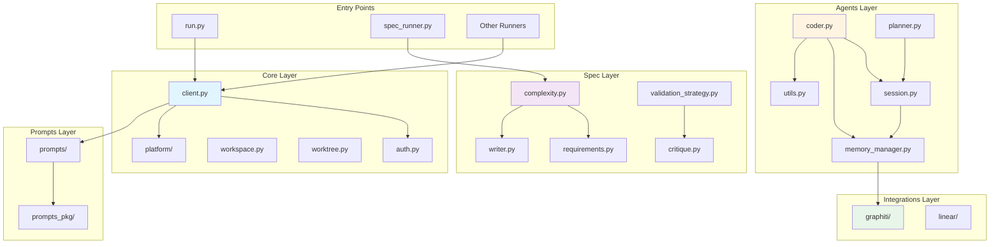
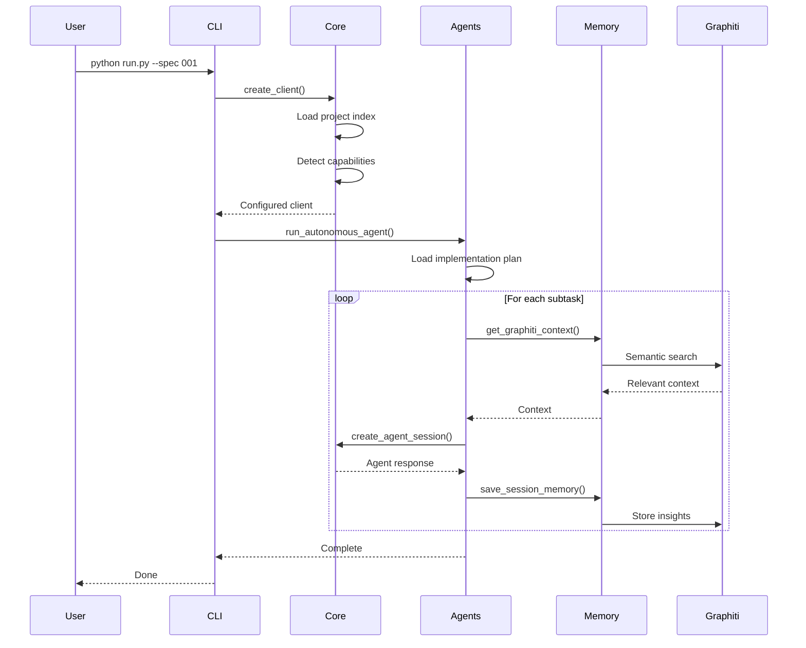

# Backend Architecture

Auto Claude backend is a Python-based AI agent orchestration system that coordinates multi-agent sessions for autonomous software development. The architecture is organized into modular components, each with clear responsibilities and well-defined interfaces.

## Architecture Overview

```
apps/backend/
├── core/              # Client factory, auth, security, workspace management
├── agents/            # Agent implementations (planner, coder, qa_reviewer, qa_fixer)
├── spec/              # Spec creation and validation
├── prompts/           # Agent system prompts
├── prompts_pkg/       # Prompt generation utilities
├── integrations/      # Graphiti memory, Linear integration
├── cli/               # Command-line interface
├── runners/           # Task runners (spec_runner, insights_runner, etc.)
├── context/           # Project analysis and stack detection
├── analysis/          # Code analysis and evaluation
├── guides/            # Documentation and guides
├── ideation/          # Feature ideation and brainstorming
├── implementation_plan/  # Implementation plan management
├── memory/            # Memory system utilities
├── merge/             # Git merge utilities
├── planner_lib/       # Planning libraries
├── plugins/           # Plugin system
├── prediction/        # Prediction and estimation
├── project/           # Project management
├── qa/                # Quality assurance
├── review/            # Code review
├── scripts/           # Utility scripts
├── security/          # Security utilities
├── services/          # Backend services
├── task_logger/       # Task logging
└── ui/                # UI utilities (Python-based)
```

## Core Module (`core/`)

The core module provides the foundational infrastructure for all AI agent interactions. All AI interactions use the Claude Agent SDK (`claude-agent-sdk` package), NEVER the Anthropic API directly.

### Key Components

#### `client.py` (907 lines)
**Claude SDK Client Factory** - Central client creation with security hooks and tool permissions.

**Key Features:**
- Project index caching (5-minute TTL) for performance
- Agent-specific tool permissions (planner, coder, qa_reviewer, qa_fixer)
- Dynamic MCP server integration based on project capabilities
- Extended thinking token budget control
- Multi-layered security (sandbox, permissions, security hooks)

**Usage:**
```python
from core.client import create_client

# Create SDK client for coder agent
client = create_client(
    project_dir=project_dir,
    spec_dir=spec_dir,
    model="claude-sonnet-4-5-20250929",
    agent_type="coder",
    max_thinking_tokens=None
)

# Run agent session
response = client.create_agent_session(
    name="coder-agent-session",
    starting_message="Implement the authentication feature"
)
```

#### `auth.py` (993 lines)
**OAuth Authentication Management** - Centralized authentication token resolution with fallback support.

**Key Features:**
- OAuth token resolution from Claude Code CLI
- Platform-specific secret storage (Keychain on macOS, Credential Manager on Windows, secret-service on Linux)
- SDK environment variable passthrough for custom API endpoints
- Intentionally prevents falling back to `ANTHROPIC_API_KEY` to avoid silent API billing

**Environment Variables (Priority Order):**
1. `CLAUDE_CODE_OAUTH_TOKEN` - OAuth token from Claude Code CLI
2. `ANTHROPIC_AUTH_TOKEN` - CCR/proxy token (enterprise setups)

**Passthrough Variables (for SDK subprocess):**
- `ANTHROPIC_BASE_URL` - Custom API endpoint
- `ANTHROPIC_AUTH_TOKEN` - Auth token
- `ANTHROPIC_MODEL` - Model override

#### `workspace.py` (2,096 lines)
**Workspace Management** - Git worktree isolation for safe feature development.

**Key Features:**
- Worktree creation and management
- Spec branch isolation (`auto-claude/{spec-name}`)
- Workspace state tracking
- Merge operations (spec branch → main)
- Cleanup and discard operations

**Functions:**
- `create_worktree()` - Create isolated worktree for spec development
- `get_worktree_path()` - Get worktree path for a spec
- `merge_worktree()` - Merge completed worktree back to main
- `cleanup_worktree()` - Remove worktree after merge/discard

#### `worktree.py` (1,513 lines)
**Git Worktree Operations** - Low-level Git worktree management.

**Key Features:**
- Worktree creation/deletion
- Branch management
- Status checking
- Git command execution with error handling

#### `progress.py` (486 lines)
**Progress Tracking** - Visual progress indicators for long-running operations.

**Key Features:**
- Progress bars for downloads and file operations
- Terminal output formatting
- ETA calculation

#### `platform/` (directory)
**Platform Abstraction Layer** - Cross-platform compatibility for Windows, macOS, and Linux.

**Key Features:**
- Centralized platform detection (`isWindows()`, `isMacOS()`, `isLinux()`)
- Path handling (`joinPaths()`, `getPathDelimiter()`)
- Executable discovery (`findExecutable()`)
- Platform-specific binary paths

**Usage:**
```python
from core.platform import isWindows, findExecutable, joinPaths

if isWindows():
    claudePath = await findExecutable('claude')
fullPath = joinPaths(dir, 'subdir', 'file.txt')
```

#### `providers/` (directory)
**LLM Provider Adapters** - Multi-provider support for different LLM backends.

**Supported Providers:**
- Anthropic (Claude)
- LiteLLM (OpenAI, Azure, etc.)
- OpenRouter

**Key Files:**
- `factory.py` - Provider factory
- `config.py` - Provider configuration
- `adapters/` - Provider-specific adapters

#### Other Core Components

| File | Lines | Purpose |
|------|-------|---------|
| `simple_client.py` | 342 | Simple client for one-off message calls |
| `cost_tracking.py` | 301 | Token usage and cost tracking |
| `token_tracker.py` | 293 | Token counting and budget management |
| `model_fallback.py` | 219 | Model fallback logic |
| `debug.py` | 349 | Debug utilities |
| `sentry.py` | 417 | Error tracking and reporting |
| `file_utils.py` | 121 | File operations utilities |
| `io_utils.py` | 94 | I/O utilities |
| `dependency_validator.py` | 134 | Platform dependency validation |
| `gh_executable.py` | 191 | GitHub CLI executable detection |
| `git_executable.py` | 198 | Git executable detection |
| `agent.py` | 63 | Agent base definitions |
| `model_config.py` | 68 | Model configuration |
| `plan_normalization.py` | 50 | Plan data normalization |
| `phase_event.py` | 59 | Phase event tracking |
| `workspace/` (dir) | - | Workspace display and finalization |

### Core Module Dependencies

```
client.py
  ├── auth.py (OAuth token resolution)
  ├── platform/ (platform detection, executable discovery)
  └── providers/ (LLM provider factory)

workspace.py
  ├── worktree.py (Git operations)
  └── platform/ (path handling)

auth.py
  └── platform/ (platform-specific secret storage)
```

## Agents Module (`agents/`)

Modular agent system for autonomous coding. This module refactors the original monolithic `agent.py` into focused, maintainable modules.

### Architecture

```
agents/
├── __init__.py          # Public API exports (lazy imports)
├── base.py              # Shared constants
├── utils.py             # Git operations and plan management
├── memory_manager.py    # Memory management (Graphiti + file-based)
├── session.py           # Agent session execution
├── planner.py           # Follow-up planner logic
└── coder.py             # Main autonomous agent loop
```

### Module Breakdown

#### `base.py` (15 lines)
**Shared Constants** - Common constants used across agent modules.

**Constants:**
- `AUTO_CONTINUE_DELAY_SECONDS` - Delay before auto-continuing stuck agents
- `HUMAN_INTERVENTION_FILE` - File to trigger human intervention

#### `utils.py` (181 lines)
**Utility Functions** - Git operations and plan management.

**Key Functions:**
- `get_latest_commit()` - Get latest commit hash
- `get_commit_count()` - Get total commit count
- `load_implementation_plan()` - Load implementation plan from JSON
- `find_subtask_in_plan()` - Find subtask by ID
- `find_phase_for_subtask()` - Find phase containing subtask
- `sync_spec_to_source()` - Sync spec worktree to source project

#### `memory_manager.py` (494 lines)
**Memory Management** - Dual-layer memory system (Graphiti primary, file-based fallback).

**Key Functions:**
- `get_graphiti_memory()` - Get Graphiti memory instance
- `get_graphiti_context()` - Retrieve relevant context for subtasks
- `save_session_memory()` - Save session insights to memory
- `save_session_to_graphiti()` - Backwards compatibility wrapper
- `debug_memory_system_status()` - Memory system diagnostics

**Architecture:**
```
Memory Manager
├── Graphiti Memory (Primary)
│   ├── LadybugDB (embedded graph database)
│   ├── Semantic search
│   └── Session insights
└── File-based Memory (Fallback)
    ├── session_memory.json
    └── discoveries.json
```

#### `session.py` (554 lines)
**Agent Session Execution** - Execute a single agent session with post-processing.

**Key Functions:**
- `run_agent_session()` - Execute a single agent session
- `post_session_processing()` - Process results and update memory

**Features:**
- Session logging and tool tracking
- Recovery manager integration
- Memory save operations
- Error handling and retry logic

#### `planner.py` (183 lines)
**Follow-up Planner** - Add new subtasks to completed specs.

**Key Functions:**
- `run_followup_planner()` - Add new subtasks to completed specs
- Follow-up planning workflow
- Plan validation and status updates

#### `coder.py` (616 lines)
**Main Autonomous Agent** - Core autonomous agent loop with planning and coding phases.

**Key Functions:**
- `run_autonomous_agent()` - Main autonomous agent loop
- Planning and coding phase management
- Linear integration (optional)
- Recovery and stuck subtask handling

**Workflow:**
```
1. Planning Phase
   ├── Create implementation plan (if needed)
   └── Break down into subtasks

2. Coding Phase
   ├── For each subtask:
   │   ├── Get context from memory
   │   ├── Run agent session
   │   ├── Save insights to memory
   │   └── Update plan status
   └── Handle stuck subtasks

3. QA Phase
   ├── Run QA reviewer
   └── Fix issues (if any)
```

### Public API

The `agents` module exports a clean public API using lazy imports:

```python
from agents import (
    # Main functions
    run_autonomous_agent,
    run_followup_planner,

    # Memory functions
    save_session_memory,
    get_graphiti_context,
    debug_memory_system_status,

    # Session management
    run_agent_session,
    post_session_processing,

    # Utilities
    get_latest_commit,
    get_commit_count,
    load_implementation_plan,
    find_subtask_in_plan,
    find_phase_for_subtask,
    sync_spec_to_source,

    # Constants
    AUTO_CONTINUE_DELAY_SECONDS,
    HUMAN_INTERVENTION_FILE,
)
```

### Module Dependencies

```
coder.py
  ├── session.py (run_agent_session, post_session_processing)
  ├── memory_manager.py (get_graphiti_context, debug_memory_system_status)
  └── utils.py (git operations, plan management)

session.py
  ├── memory_manager.py (save_session_memory)
  └── utils.py (git operations, plan management)

planner.py
  └── session.py (run_agent_session)

memory_manager.py
  └── integrations/graphiti/ (Graphiti memory system)
```

## Spec Module (`spec/`)

Spec creation and validation system with dynamic complexity-based phase selection.

### Architecture

```
spec/
├── __init__.py             # Public API
├── complexity.py           # Complexity assessment (463 lines)
├── validation_strategy.py  # Validation logic (1,033 lines)
├── critique.py             # Spec self-critique (369 lines)
├── requirements.py         # Requirements gathering (184 lines)
├── discovery.py            # Project discovery (133 lines)
├── context.py              # Context building (128 lines)
├── writer.py               # Spec writing (74 lines)
├── compaction.py           # Spec compaction (192 lines)
├── phases/                 # Phase implementations
├── pipeline/               # Pipeline orchestration
└── validate_pkg/           # Validation utilities
```

### Key Components

#### `complexity.py` (463 lines)
**Complexity Assessment** - AI-based complexity evaluation for spec creation.

**Complexity Tiers:**
- **SIMPLE** (1-2 files): 3 phases - Discovery → Quick Spec → Validate
- **STANDARD** (3-10 files): 6 phases - Discovery → Requirements → Context → Spec → Plan → Validate
- **STANDARD + Research**: 7 phases - Standard + Research phase
- **COMPLEX** (10+ files): 8 phases - Full pipeline with research and self-critique

**Assessment Factors:**
- Number of files/services involved
- External integrations and research requirements
- Infrastructure changes (Docker, databases, etc.)
- Existing patterns in codebase
- Risk factors and edge cases

#### `validation_strategy.py` (1,033 lines)
**Validation Strategy** - Comprehensive spec validation with checkpoint system.

**Validation Checkpoints:**
- `all` - Run all validations
- `structure` - Validate spec structure
- `requirements` - Validate requirements completeness
- `context` - Validate context gathering
- `plan` - Validate implementation plan
- `acceptance` - Validate acceptance criteria

#### `critique.py` (369 lines)
**Spec Critique** - Self-critique using ultrathink for quality improvement.

**Features:**
- Identifies missing requirements
- Suggests improvements
- Validates technical approach
- Checks for edge cases

#### `requirements.py` (184 lines)
**Requirements Gathering** - Structured requirements collection.

**Output:**
- `requirements.json` - Structured user requirements
- Functional requirements
- Edge cases
- Acceptance criteria

#### `discovery.py` (133 lines)
**Project Discovery** - Analyze codebase structure and patterns.

**Discovery:**
- Project structure
- Tech stack detection
- Existing patterns
- Integration points

#### `context.py` (128 lines)
**Context Building** - Gather relevant context for spec creation.

**Context Sources:**
- Codebase files
- Documentation
- Similar patterns
- Integration points

#### `writer.py` (74 lines)
**Spec Writing** - Generate `spec.md` from gathered information.

**Output:**
- `spec.md` - Feature specification
- Structured sections (Overview, Scope, Requirements, etc.)

#### `compaction.py` (192 lines)
**Spec Compaction** - Optimize spec size by removing redundant context.

**Features:**
- Remove duplicate files
- Compact context
- Preserve essential information

### Spec Directory Structure

Each spec in `.auto-claude/specs/XXX-name/` contains:
```
XXX-name/
├── spec.md                  # Feature specification
├── requirements.json        # Structured user requirements
├── context.json             # Discovered codebase context
├── implementation_plan.json # Subtask-based plan with status tracking
├── qa_report.md             # QA validation results
└── QA_FIX_REQUEST.md        # Issues to fix (when rejected)
```

### Spec Creation Pipeline

**Entry Point:** `runners/spec_runner.py` (422 lines)

**Dynamic Phase Selection:**
```python
# Complexity Assessment
AI Assessment (complexity_assessor.md prompt)
├── Considers: scope, integrations, infrastructure, knowledge, risk
└── Falls back to heuristic analysis if AI fails

# Phase Execution
SIMPLE (3 phases)
├── Discovery
├── Quick Spec
└── Validate

STANDARD (6-7 phases)
├── Discovery
├── Requirements
├── Research (if external integrations detected)
├── Context
├── Spec
├── Plan
└── Validate

COMPLEX (8 phases)
├── All STANDARD phases
└── Self-Critique (uses ultrathink)
```

## Integrations Module (`integrations/`)

External service integrations for memory and project management.

### Graphiti Memory (`integrations/graphiti/`)

**Mandatory** memory system with embedded LadybugDB (no Docker required).

**Architecture:**
```
integrations/graphiti/
├── queries_pkg/
│   ├── graphiti.py      # Main GraphitiMemory class
│   ├── client.py        # LadybugDB client wrapper
│   ├── queries.py       # Graph query operations
│   ├── search.py        # Semantic search logic
│   └── schema.py        # Graph schema definitions
├── graphiti_config.py   # Configuration and validation
└── graphiti_providers.py # Multi-provider factory
```

**Multi-Provider Support:**
- **LLM Providers:** OpenAI, Anthropic, Azure OpenAI, Ollama, Google AI (Gemini)
- **Embedder Providers:** OpenAI, Voyage AI, Azure OpenAI, Ollama, Google AI

**Key Features:**
- Graph database with semantic search
- Session insights extraction
- Cross-session context persistence
- Knowledge graph for relationships

**Usage:**
```python
from integrations.graphiti.memory import get_graphiti_memory

memory = get_graphiti_memory(spec_dir, project_dir)
context = memory.get_context_for_session("Implementing feature X")
memory.add_session_insight("Pattern: use React hooks for state")
```

**Configuration (apps/backend/.env):**
```bash
GRAPHITI_ENABLED=true
ANTHROPIC_API_KEY=sk-ant-...

# Optional: Custom providers
GRAPHITI_LLM_PROVIDER=openai
GRAPHITI_EMBEDDER_PROVIDER=voyage
```

### Linear Integration (`integrations/linear/`)

**Optional** Linear integration for progress tracking.

**Features:**
- Issue creation and updates
- Progress synchronization
- Status tracking

## Prompts Module (`prompts/`)

Agent system prompts for different agent types and workflows.

### Agent Prompts

| Prompt | Purpose | Lines |
|--------|---------|-------|
| `planner.md` | Creates implementation plan with subtasks | 31,355 |
| `coder.md` | Implements individual subtasks | 34,155 |
| `coder_recovery.md` | Recovers from stuck/failed subtasks | 9,122 |
| `qa_reviewer.md` | Validates acceptance criteria | 15,385 |
| `qa_fixer.md` | Fixes QA-reported issues | 9,086 |

### Spec Creation Prompts

| Prompt | Purpose | Lines |
|--------|---------|-------|
| `complexity_assessor.md` | AI-based complexity assessment | 22,076 |
| `spec_gatherer.md` | Collects user requirements | 5,132 |
| `spec_researcher.md` | Validates external integrations | 9,536 |
| `spec_writer.md` | Creates spec.md document | 8,031 |
| `spec_critic.md` | Self-critique using ultrathink | 8,828 |
| `spec_quick.md` | Quick spec for simple tasks | 4,068 |
| `followup_planner.md` | Follow-up planning | 10,067 |
| `validation_fixer.md` | Fixes validation failures | 5,669 |

### Other Prompts

| Prompt | Purpose | Lines |
|--------|---------|-------|
| `competitor_analysis.md` | Analyze competitors | 11,332 |
| `insight_extractor.md` | Extract insights from sessions | 5,608 |
| `roadmap_discovery.md` | Roadmap discovery | 11,838 |
| `roadmap_features.md` | Roadmap features | 13,083 |
| `ideation_*.md` | Various ideation prompts | 5-11k each |

### Prompts Utilities (`prompts_pkg/`)

| File | Purpose | Lines |
|------|---------|-------|
| `prompts.py` | Prompt loading and rendering | 18,931 |
| `prompt_generator.py` | Dynamic prompt generation | 13,125 |
| `project_context.py` | Project context injection | 9,200 |

## CLI Module (`cli/`)

Command-line interface for Auto Claude.

**Key Files:**
- Entry point for CLI commands
- Command parsing and validation
- Help and usage information

## Runners Module (`runners/`)

Task runners for different workflows.

### Key Runners

| Runner | Purpose | Lines |
|--------|---------|-------|
| `spec_runner.py` | Spec creation orchestrator | 422 |
| `insights_runner.py` | Extract insights from sessions | 15,428 |
| `ideation_runner.py` | Feature ideation | 5,142 |
| `roadmap_runner.py` | Roadmap generation | 4,412 |
| `ai_analyzer_runner.py` | AI-based code analysis | 2,438 |

### Task Runners

**GitHub (`runners/github/`):**
- Issue management
- PR automation
- Repository operations

**GitLab (`runners/gitlab/`):**
- GitLab integration
- MR automation

## Other Backend Modules

| Module | Purpose |
|--------|---------|
| `context/` | Project analysis and stack detection |
| `analysis/` | Code analysis and evaluation tools |
| `guides/` | Documentation and guides |
| `ideation/` | Feature ideation and brainstorming |
| `implementation_plan/` | Implementation plan management |
| `memory/` | Memory system utilities |
| `merge/` | Git merge utilities |
| `planner_lib/` | Planning libraries |
| `plugins/` | Plugin system |
| `prediction/` | Prediction and estimation |
| `project/` | Project management |
| `qa/` | Quality assurance |
| `review/` | Code review |
| `scripts/` | Utility scripts |
| `security/` | Security utilities |
| `services/` | Backend services |
| `task_logger/` | Task logging |
| `ui/` | UI utilities (Python-based) |

## Environment Variables

### Required

```bash
# Memory System
GRAPHITI_ENABLED=true

# Authentication (Claude SDK)
CLAUDE_CODE_OAUTH_TOKEN=...  # From Claude Code CLI
ANTHROPIC_AUTH_TOKEN=...     # Optional: CCR/proxy token
```

### Optional

```bash
# Custom API Endpoint
ANTHROPIC_BASE_URL=https://custom-api.example.com

# Model Override
ANTHROPIC_MODEL=claude-sonnet-4-5-20250929

# Graphiti Providers
GRAPHITI_LLM_PROVIDER=openai
GRAPHITI_EMBEDDER_PROVIDER=voyage

# Electron MCP (for E2E testing)
ELECTRON_MCP_ENABLED=true
ELECTRON_DEBUG_PORT=9222

# Linear Integration (optional)
LINEAR_API_KEY=...
LINEAR_PROJECT_ID=...

# Debug Mode
DEBUG=true
```

## Platform Requirements

### Python Version
- **Required:** Python 3.12+ (for Graphiti/LadybugDB)

### Platform-Specific Dependencies

**Windows:**
- `pywin32>=306` (required for LadybugDB)

**macOS:**
- Standard Python environment
- Keychain for secret storage

**Linux:**
- `secretstorage` (for secret-service support)
- Standard Python environment

## Key Dependencies

```python
# Core
claude-agent-sdk>=0.1.19  # AI agent orchestration
python-dotenv             # Environment variable management

# Memory System
graphiti-core>=0.5.0      # Graph-based memory
real_ladybug>=0.13.0      # Embedded graph database
pandas>=2.2.0             # Data manipulation for Graphiti

# Platform-Specific
pywin32>=306              # Windows only (LadybugDB)
secretstorage             # Linux only (secret-service)
```

## Entry Points

### Main Entry Point
```bash
cd apps/backend
python run.py --spec <spec_id>
```

### Spec Creation
```bash
cd apps/backend
python runners/spec_runner.py --task "Add user authentication"
python runners/spec_runner.py --interactive
```

### Other Runners
```bash
# Extract insights
python runners/insights_runner.py

# Feature ideation
python runners/ideation_runner.py

# Roadmap generation
python runners/roadmap_runner.py
```

## Architecture Diagram



## Data Flow



## Best Practices

### DO
- Use `create_client()` from `core.client` for all AI interactions
- Follow the modular structure when adding new features
- Use lazy imports in `__init__.py` to avoid circular dependencies
- Document platform-specific code in `core/platform/`
- Use Graphiti for all memory operations (enabled by default)
- Test on all three platforms (Windows, macOS, Linux)

### DON'T
- Use `anthropic.Anthropic()` directly - always use the SDK client
- Hardcode paths - use `core.platform` abstractions
- Skip platform testing - CI tests all platforms
- Assume prior knowledge - document technical terms
- Add new agents without updating tool permissions in `client.py`
- Use time estimates in documentation or prompts

## Further Reading

- [Claude SDK Integration](../api/backend-api.md)
- [Memory System Architecture](../diagrams/memory-system.mermaid)
- [Security Model](../diagrams/security-model.mermaid)
- [End-to-End Testing](../integration/e2e-testing.md)
