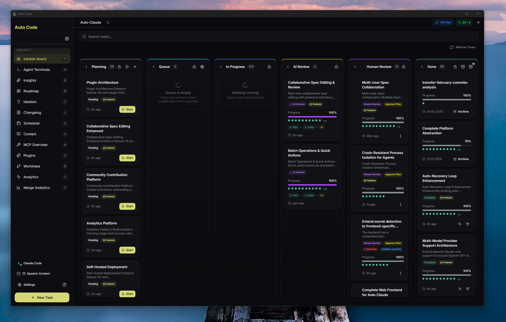
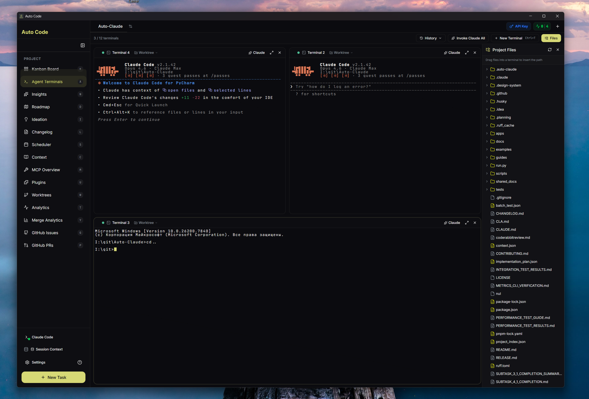
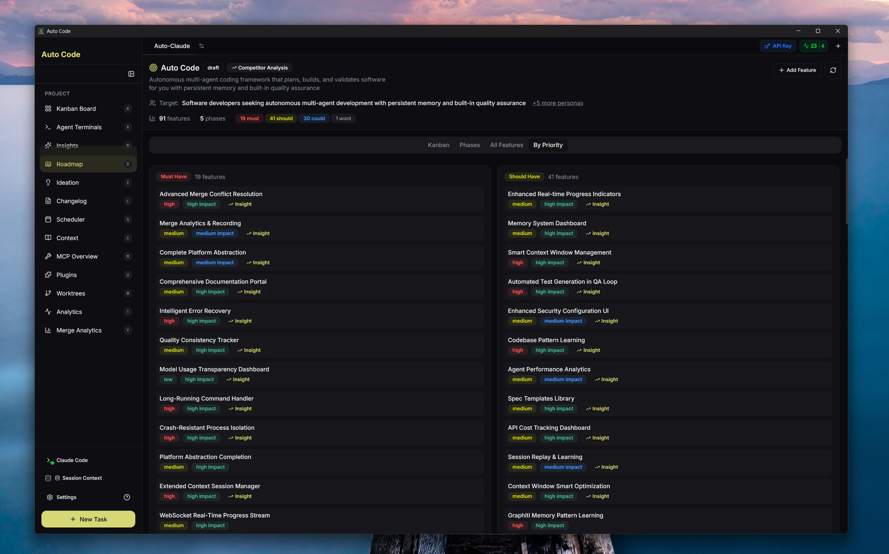

<div align="center">

# Auto Code

**Autonomous AI agents that plan, build, and test your software.**

Describe what you want. Auto Code creates the spec, writes the code, runs QA, and hands you a clean branch to review.

[](./LICENSE)
[](https://github.com/OBenner/Auto-Coding/actions)
[]()
[](https://github.com/OBenner/Auto-Coding/releases)

</div>

---

<!-- DEMO_GIF_PLACEHOLDER
     To add an animated demo:
     1. Record a GIF/video showing a task going from creation to merged PR
     2. Save it to .github/assets/demo.gif (keep under 10 MB)
     3. Replace this comment block with:
        <p align="center">
          
        </p>
-->

<p align="center">
  
</p>

---

## What is Auto Code?

Auto Code is a multi-agent framework that turns a plain-language task description into working, tested code. You describe what you want, and a pipeline of specialized AI agents creates a specification, plans the implementation, writes the code, and validates it through automated QA -- all in isolated git worktrees so your main branch is never at risk. A built-in memory system means agents learn from previous sessions and get smarter over time.

---

## Features

<table>
<tr>
<td width="50%">

### Multi-Agent Pipeline
Planner, Coder, QA Reviewer, and QA Fixer agents work in sequence -- each with a focused role and clear handoff.

### Isolated Workspaces
Every build runs in its own git worktree. Your main branch stays clean until you explicitly merge.

### Cross-Session Memory
Graphiti-powered knowledge graph stores patterns, gotchas, and discoveries so agents improve across builds.

### Self-Validating QA
A dedicated QA loop catches issues before you ever look at the code, with optional E2E testing via Electron.

</td>
<td width="50%">

### Parallel Execution
Run up to 12 agent terminals simultaneously. The Coder agent can spawn subagents for parallel subtask work.

### GitHub, GitLab & Linear Integration
Import issues, create PRs, and sync progress with your existing project management tools.

### Multi-Provider LLM Support
Works with Claude, OpenAI, Google Gemini, Azure OpenAI, Ollama, and more -- not locked to a single model.

### Cross-Platform
Native desktop apps for Windows, macOS, and Linux. Cloud-hosted option also available.

</td>
</tr>
</table>

---

## Screenshots

<details>
<summary><strong>Kanban Board</strong> -- visual task management from planning through completion</summary>
<br />

</details>

<details>
<summary><strong>Agent Terminals</strong> -- multiple AI-powered terminals with one-click task context</summary>
<br />

</details>

<details>
<summary><strong>Roadmap</strong> -- AI-assisted feature planning with competitor analysis</summary>
<br />

</details>

---

## Quick Start

1. **Download** the latest release for your platform from [Releases](https://github.com/OBenner/Auto-Coding/releases)
2. **Open your project** -- select any git repository folder
3. **Connect Claude** -- the app walks you through OAuth setup (requires [Claude Pro/Max](https://claude.ai/upgrade))
4. **Create a task** -- describe what you want to build in plain language
5. **Watch it work** -- agents plan, code, and validate autonomously; you review and merge

---

## How It Works

```
 You describe a task
        |
        v
 +--------------+     +-----------+     +--------+     +-------------+     +-----------+
 | Spec Creation | --> |  Planner  | --> | Coder  | --> | QA Reviewer | --> | QA Fixer  |
 +--------------+     +-----------+     +--------+     +-------------+     +-----------+
                                                                                  |
                                                                                  v
                                                                        You review & merge
```

**Spec Creation** analyzes your request and produces a structured specification. The **Planner** breaks it into subtasks. The **Coder** implements each subtask (spawning subagents for parallel work when needed). The **QA Reviewer** validates against acceptance criteria, and the **QA Fixer** resolves any issues in a loop. You get a clean branch ready to merge.

---

## Deployment Options

**Desktop (recommended for individual developers)** -- Download and run the native app. All processing happens locally.

**Cloud-hosted (not ready)** – Deploy to your infrastructure for centralized, multi-user access with OAuth, usage tracking, and Kubernetes support. See the [Cloud Setup Guide](guides/CLOUD_SETUP.md).

---

## CLI Usage

For headless operation, CI/CD integration, or terminal workflows:

```bash
cd apps/backend

python spec_runner.py --interactive       # Create a spec interactively
python spec_runner.py --task "Add auth"   # Create spec from description

python run.py --spec 001                  # Run autonomous build
python run.py --spec 001 --review         # Review changes
python run.py --spec 001 --merge          # Merge into your branch
```

See [CLI Usage Guide](guides/CLI-USAGE.md) for full documentation.

---

## Security

Auto Code uses a three-layer security model:

- **OS Sandbox** -- bash commands run in isolation
- **Filesystem restrictions** -- operations limited to the project directory
- **Dynamic command allowlist** -- only approved commands based on detected project stack

All releases include SHA256 checksums. macOS builds are code-signed.

---

## Community

- [Discord](https://discord.gg/KCXaPBr4Dj) -- chat, get help, share what you're building
- [Issues](https://github.com/OBenner/Auto-Coding/issues) -- report bugs or request features
- [Discussions](https://github.com/OBenner/Auto-Coding/discussions) -- ask questions and share ideas

---

## Contributing

Contributions are welcome. See [CONTRIBUTING.md](CONTRIBUTING.md) for setup instructions, code style, testing, and PR guidelines.

---

## Credits

Auto Code was originally forked from [AndyMik90/Auto-Code](https://github.com/AndyMik90/Auto-Code). Thank you to the original author for laying the foundation.

---

## License

[AGPL-3.0](./LICENSE) -- Auto Code is free to use. If you modify and distribute it, or run it as a service, your changes must also be open source under AGPL-3.0.

---

<div align="center">

[](https://github.com/OBenner/Auto-Coding/stargazers)

[](https://star-history.com/#OBenner/Auto-Coding&Date)

</div>
