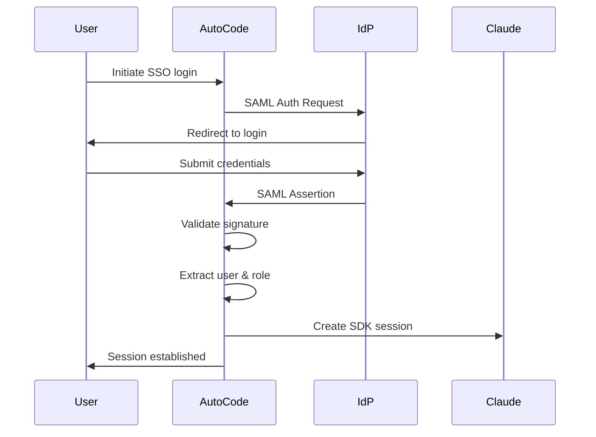
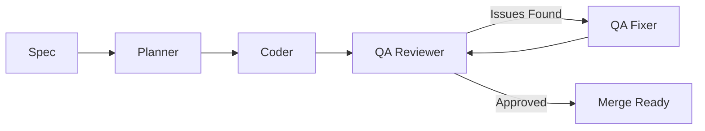

# SOC2 Compliance

Auto Code implements comprehensive security controls to meet SOC2 (Service Organization Control 2) compliance requirements for enterprise deployments. This document describes how Auto Code addresses the SOC2 Trust Services Criteria.

## Table of Contents

- [Overview](#overview)
- [Security](#security)
  - [Access Control](#access-control)
  - [Audit Logging](#audit-logging)
  - [Authentication](#authentication)
  - [Data Encryption](#data-encryption)
  - [Network Security](#network-security)
- [Availability](#availability)
- [Processing Integrity](#processing-integrity)
- [Confidentiality](#confidentiality)
- [Privacy](#privacy)
- [Compliance Monitoring](#compliance-monitoring)
- [Audit Evidence](#audit-evidence)

---

## Overview

SOC2 is a compliance framework for service organizations that handle customer data. Auto Code implements controls across the five SOC2 Trust Services Criteria:

- **Security** - Protection against unauthorized access
- **Availability** - System performance and uptime
- **Processing Integrity** - Complete and accurate processing
- **Confidentiality** - Protection of confidential information
- **Privacy** - Personal information handling

Auto Code's enterprise features provide built-in compliance controls for SOC2 Type I and Type II audits.

---

## Security

### Access Control

Auto Code implements role-based access control (RBAC) to restrict system access based on user roles.

#### Role Definitions

| Role | Description | Permissions |
|------|-------------|-------------|
| **ADMIN** | Full system access | All permissions (29 total) |
| **DEVELOPER** | Can create specs and run builds | Spec management, build execution, code operations (17 permissions) |
| **OPERATOR** | Can run builds but not modify specs | Build execution, limited code operations (10 permissions) |
| **AUDITOR** | Read-only access to compliance data | Audit logs, compliance reports (4 permissions) |
| **VIEWER** | Read-only access to specs | Spec viewing, limited audit access (5 permissions) |

#### Permission Enforcement

All agent operations require permission checks:

```python
from enterprise.permissions import require_permission, Role

@require_permission(Permission.BUILD_RUN)
def run_build(spec_id: str, user_role: Role):
    """Only users with BUILD_RUN permission can execute builds."""
    ...
```

Permission checks are logged to the audit trail with correlation IDs.

#### Permission Categories

- **Spec Management** - Create, read, update, delete specifications
- **Build Execution** - Run, stop, review, merge, discard builds
- **Agent Operations** - Run planner, coder, and QA agents
- **Code Operations** - Read, write, execute, and review code
- **Audit & Compliance** - Read and export audit logs and compliance reports
- **Configuration** - Update system settings, configure SSO and data residency
- **User Management** - Create, read, update, delete users and assign roles

### Audit Logging

Auto Code maintains comprehensive, tamper-evident audit logs for all system operations.

#### Audit Events

The system captures over 30 distinct event types across categories:

**Authentication & SSO:**
- `sso_login_started` / `sso_login_completed` / `sso_login_failed`
- `saml_assertion_verified` / `saml_assertion_rejected`
- `token_issued` / `token_refreshed` / `token_revoked`
- `session_created` / `session_expired` / `logout`

**Data Residency & Compliance:**
- `data_residency_validated` / `data_residency_violation`
- `data_transfer_requested` / `data_transfer_approved` / `data_transfer_denied`
- `data_deletion_requested` / `data_deletion_completed`
- `data_export_requested` / `data_export_completed`

**RBAC & Permissions:**
- `role_assigned` / `role_revoked`
- `permission_granted` / `permission_denied` / `permission_checked`
- `access_approved` / `access_denied`

**Agent & Build Operations:**
- `agent_planner_started` / `agent_planner_completed` / `agent_planner_failed`
- `agent_coder_started` / `agent_coder_completed` / `agent_coder_failed`
- `agent_qa_reviewer_started` / `agent_qa_reviewer_completed` / `agent_qa_reviewer_failed`
- `agent_qa_fixer_started` / `agent_qa_fixer_completed` / `agent_qa_fixer_failed`
- `build_started` / `build_completed` / `build_failed`
- `code_generated` / `code_modified` / `code_deleted`

#### Audit Log Structure

Each audit entry contains:

```json
{
  "timestamp": "2024-02-13T10:30:45.123456Z",
  "action": "agent_coder_started",
  "actor": {
    "type": "user",
    "id": "user_123",
    "role": "developer"
  },
  "correlation_id": "evt_1a2b3c4d5e6f7g8h",
  "ip_address": "192.168.1.100",
  "user_agent": "Auto-Code/3.0.0",
  "spec_id": "137",
  "subtask_id": "subtask-6-1",
  "status": "started",
  "metadata": {
    "model": "claude-sonnet-4-5",
    "max_thinking_tokens": 16000
  }
}
```

#### Audit Log Storage

- **Location:** `.auto-claude/enterprise/audit/`
- **Format:** JSON files (one per day)
- **Retention:** Configurable (default: 7 years for SOC2)
- **Integrity:** Immutable append-only logs
- **Export:** JSON, CSV formats for auditors

#### Compliance Reporting

Generate SOC2 audit reports:

```python
from enterprise.audit import EnterpriseAuditLogger

audit_logger = EnterpriseAuditLogger(spec_dir)

# Export last 90 days for SOC2 review
report = audit_logger.export_report(
    start_date=datetime.now() - timedelta(days=90),
    format="soc2"
)
```

### Authentication

Auto Code supports multiple authentication methods with enterprise SSO integration.

#### Supported Authentication Methods

1. **OAuth 2.0** - Standard Claude authentication
2. **SAML 2.0 SSO** - Enterprise single sign-on
3. **API Keys** - Service account authentication

#### SSO Integration

Auto Code integrates with major SAML identity providers:

- Okta
- Azure Active Directory
- Google Workspace
- OneLogin
- Auth0
- Generic SAML 2.0

**Configuration Example:**

```bash
# Enable SSO in .env
ENTERPRISE_SSO_ENABLED=true
SAML_IDP_ENTITY_ID=https://okta.com/abc123
SAML_IDP_SSO_URL=https://okta.com/sso/saml
SAML_IDP_X509_CERT="-----BEGIN CERTIFICATE-----..."
SAML_SP_ACS_URL=https://your-domain.com/saml/acs
```

#### Authentication Flow



#### Session Management

- **Session Duration:** Configurable (default: 8 hours)
- **Token Refresh:** Automatic refresh before expiry
- **Concurrent Sessions:** Limited by role (ADMIN: unlimited, VIEWER: 1)
- **Session Revocation:** Immediate on logout or role change

### Data Encryption

Auto Code implements encryption at rest and in transit.

#### Encryption in Transit

- **TLS 1.3** for all network communications
- **Certificate validation** for all API endpoints
- **HTTPS only** - HTTP redirects to HTTPS

#### Encryption at Rest

| Data Type | Encryption Method | Key Management |
|-----------|------------------|----------------|
| API Keys | AES-256-GCM | System keychain |
| Session Tokens | AES-256-GCM | In-memory keys |
| Audit Logs | Optional GPG | Customer-controlled |
| Configuration | AES-256-GCM | System keychain |

**Enable audit log encryption:**

```bash
# .env configuration
AUDIT_LOG_ENCRYPTION_ENABLED=true
AUDIT_LOG_ENCRYPTION_KEY_PATH=/path/to/gpg/key
```

### Network Security

#### Deployment Modes

| Mode | Network Access | Use Case |
|------|----------------|----------|
| **CLOUD** | Full internet access | Standard desktop usage |
| **SELF_HOSTED** | Internal network + optional internet | On-premise deployment |
| **AIR_GAPPED** | No external network access | Highly secure environments |

#### Air-Gapped Mode

For environments requiring complete network isolation:

```bash
# .env configuration
ENTERPRISE_DEPLOYMENT_MODE=air_gapped
MODEL_PROXY_URL=http://internal-llm-proxy:8000
LOCAL_MODEL_PATH=/opt/models/claude
```

**Air-gapped mode features:**
- No external API calls
- Local model proxy support
- Offline audit log storage
- Manual compliance export/import

---

## Availability

### System Monitoring

Auto Code provides built-in monitoring for SOC2 availability requirements.

#### Health Checks

```bash
# System health endpoint
curl https://your-domain.com/api/health

# Response
{
  "status": "healthy",
  "version": "3.0.0",
  "services": {
    "agent": "operational",
    "audit": "operational",
    "sso": "operational",
    "memory": "operational"
  },
  "uptime_seconds": 86400
}
```

#### Performance Metrics

Tracked metrics include:
- Agent session success rate
- Average response time
- System uptime percentage
- Error rates by operation type

### Backup & Recovery

#### Data Backup

Automated backups for:
- Audit logs (daily)
- User preferences (on change)
- SSO configuration (on change)

#### Recovery Point Objective (RPO)

| Data Type | RPO | Backup Frequency |
|-----------|-----|------------------|
| Audit Logs | 24 hours | Daily |
| User Data | 1 hour | On change |
| Configuration | Instant | Redundant storage |

---

## Processing Integrity

### Agent Execution Validation

Auto Code ensures complete and accurate processing through multi-phase validation.

#### QA Pipeline



#### Validation Checks

Each build undergoes:
1. **Spec Validation** - Requirements completeness
2. **Plan Validation** - Subtask breakdown verification
3. **Code Validation** - Syntax and lint checks
4. **Test Validation** - Unit and integration tests
5. **QA Review** - Acceptance criteria verification

#### Error Handling

All failures are logged with:
- Error type and stack trace
- Contextual metadata (spec ID, subtask ID)
- Correlation ID for traceability
- Remediation suggestions

### Data Validation

#### Input Validation

- All user inputs sanitized
- File path restrictions (project directory only)
- Command allowlist enforcement
- Type checking for all parameters

#### Output Validation

- JSON schema validation for API responses
- File integrity checks (SHA256)
- Git commit verification
- Test result validation

---

## Confidentiality

### Data Residency Controls

Auto Code supports data residency requirements for multi-region compliance.

#### Supported Regions

| Region | API Endpoint | Compliance Frameworks |
|--------|--------------|----------------------|
| **US** | `https://api.anthropic.com` | CCPA, US state privacy laws |
| **EU** | `https://api.anthropic.com` | GDPR, EU Data Act |
| **UK** | `https://api.anthropic.com` | UK Data Protection Act |
| **AP** | `https://api.anthropic.com` | APAC privacy laws |
| **GLOBAL** | `https://api.anthropic.com` | Multi-region support |

**Configuration:**

```bash
# .env configuration
DATA_RESIDENCY_REGION=EU
```

#### Data Transfer Controls

Automatic validation before data transfers:

```python
from enterprise.data_residency import DataResidencyConfig

config = DataResidencyConfig('EU')

# Check if transfer is allowed
if config.can_transfer_to_region('US'):
    # Execute transfer
    ...
else:
    # Log violation
    audit_logger.log_data_residency_violation(
        from_region='EU',
        to_region='US',
        reason='GDPR restriction'
    )
```

#### Data Retention

Configurable data retention policies:

```bash
# .env configuration
AUDIT_LOG_RETENTION_YEARS=7
USER_DATA_RETENTION_DAYS=365
BUILD_ARTIFACT_RETENTION_DAYS=90
```

### Data Classification

Auto Code classifies data by sensitivity level:

| Classification | Data Types | Storage | Access |
|----------------|------------|---------|--------|
| **Public** | Documentation, specs | Unencrypted | All users |
| **Internal** | Build logs, metrics | Encrypted | Internal users |
| **Confidential** | API keys, tokens | Encrypted | Authorized only |
| **Restricted** | SSO certs, audit logs | Encrypted | Auditors only |

---

## Privacy

### Personal Data Handling

Auto Code's privacy controls align with SOC2 Privacy criteria and GDPR requirements.

#### Data Minimization

Only collect necessary data:
- No PII stored in audit logs by default
- User IDs instead of email addresses
- IP addresses truncated (last octet zeroed)
- Optional PII redaction

```python
# Enable PII redaction
AUDIT_LOG_REDACT_PII=true
```

#### User Rights

Supported user privacy rights:

1. **Right to Access** - Export all user data
2. **Right to Deletion** - Request data deletion
3. **Right to Rectification** - Update personal data
4. **Right to Portability** - Export in machine-readable format

**Data Subject Request (DSR) Example:**

```python
from enterprise.audit import EnterpriseAuditLogger

audit_logger = EnterpriseAuditLogger(spec_dir)

# Export user data for GDPR request
user_data = audit_logger.export_user_data(
    user_id="user_123",
    format="json"
)

# Delete user data (right to be forgotten)
audit_logger.delete_user_data(
    user_id="user_123",
    reason="gdpr_deletion_request",
    approved_by="admin_456"
)
```

#### Cookie and Tracking Policy

- No tracking cookies
- No third-party analytics
- Local-only session storage
- Optional usage analytics (opt-in)

---

## Compliance Monitoring

### Continuous Compliance Monitoring

Auto Code provides real-time compliance dashboards.

#### Key Metrics

Track compliance posture with:

```bash
# View compliance status
python -m enterprise.compliance status

# Example output
Compliance Status: HEALTHY
├── Audit Logging: ✓ Active (1,234 events today)
├── Access Control: ✓ 23 users, 5 roles active
├── Data Residency: ✓ EU region, 0 violations
├── SSO: ✓ Okta integration active
└── Encryption: ✓ All logs encrypted
```

#### Alert Rules

Configure compliance alerts:

```yaml
# .auto-claude/compliance_rules.yaml
alerts:
  - name: "Multiple Failed Logins"
    condition: "failed_logins > 5 in 5 minutes"
    severity: "high"
    action: "notify_security_team"

  - name: "Data Residency Violation"
    condition: "data_residency_violation > 0"
    severity: "critical"
    action: "block_transfer_and_notify"

  - name: "Unauthorized Access Attempt"
    condition: "permission_denied > 10 in 1 minute"
    severity: "high"
    action: "temp_lock_account"
```

### Compliance Reporting

#### Automated Reports

Generate SOC2 compliance reports:

```python
from enterprise.compliance import ComplianceReportGenerator

generator = ComplianceReportGenerator()

# SOC2 Type II report (6-month period)
report = generator.generate_soc2_report(
    period_start="2024-01-01",
    period_end="2024-06-30",
    include_sections=[
        "security",
        "availability",
        "processing_integrity",
        "confidentiality",
        "privacy"
    ]
)

# Export to PDF for auditors
report.export_pdf("soc2_report_h1_2024.pdf")
```

#### Report Sections

Each SOC2 report includes:

1. **Management Assertion** - Executive summary
2. **System Description** - Architecture and controls
3. **Security Criteria** - Access controls, audit logging
4. **Availability Criteria** - Uptime, performance metrics
5. **Processing Integrity** - Validation pipeline data
6. **Confidentiality** - Data protection measures
7. **Privacy** - Personal information handling
8. **Audit Evidence** - Sample audit log entries

---

## Audit Evidence

### Preparing for SOC2 Audit

#### Evidence Collection Checklist

**Security Evidence:**
- [ ] Access control policy documentation
- [ ] User role assignments and changes (last 12 months)
- [ ] Authentication logs (all login attempts)
- [ ] Permission change logs
- [ ] SSO configuration and certificates

**Availability Evidence:**
- [ ] System uptime records
- [ ] Incident response logs
- [ ] Backup and restore test results
- [ ] Performance metrics (response times)

**Processing Integrity Evidence:**
- [ ] QA validation results
- [ ] Error rates and resolution times
- [ ] Data validation logs
- [ ] Test execution reports

**Confidentiality Evidence:**
- [ ] Data residency configuration
- [ ] Encryption key management records
- [ ] Data transfer logs (with approvals)
- [ ] Data classification policy

**Privacy Evidence:**
- [ ] Data retention settings
- [ ] Data subject request logs
- [ ] Privacy policy documentation
- [ ] Cookie and tracking disclosure

#### Export Audit Trail

```bash
# Export audit logs for SOC2 examination
python -m enterprise.audit export \
  --start-date 2024-01-01 \
  --end-date 2024-12-31 \
  --format json \
  --output soc2_audit_2024.json

# Generate human-readable report
python -m enterprise.audit report \
  --start-date 2024-01-01 \
  --end-date 2024-12-31 \
  --format soc2 \
  --output soc2_report_2024.pdf
```

#### Auditor Access

Create temporary auditor access:

```python
from enterprise.permissions import Role, create_user

# Create auditor account
auditor = create_user(
    username="soc2_auditor_2024",
    role=Role.AUDITOR,
    expires_at="2024-12-31"
)

# Auditor can read but not modify:
# - Audit logs
# - Compliance reports
# - User access records
# - Configuration (read-only)
```

### Frequently Asked Questions

**Q: Does Auto Code include SOC2 certification?**

A: Auto Code provides SOC2-ready controls and documentation. Customers are responsible for their own SOC2 audit and certification. Auto Code's audit logs and compliance reports provide the evidence needed for your audit.

**Q: How long are audit logs retained?**

A: Default retention is 7 years to meet SOC2 requirements. This is configurable via the `AUDIT_LOG_RETENTION_YEARS` environment variable.

**Q: Can I use my own SSO provider?**

A: Yes, Auto Code supports any SAML 2.0-compatible identity provider. See the [SSO Setup Guide](../enterprise/SSO_SETUP.md) for configuration instructions.

**Q: Is there a SOC2 Type II report available?**

A: Auto Code generates SOC2 Type II reports on-demand using the collected audit data. Run the compliance report generator to create a report for any time period.

**Q: How do I prove data residency compliance?**

A: All data residency checks are logged with correlation IDs. Export audit logs filtered by `data_residency_validated` and `data_residency_violation` events to demonstrate compliance.

---

## See Also

- [GDPR Compliance](GDPR_COMPLIANCE.md) - GDPR-specific controls
- [Enterprise Deployment Guide](../enterprise/DEPLOYMENT_GUIDE.md) - Self-hosted setup
- [SSO Setup Guide](../enterprise/SSO_SETUP.md) - SAML configuration
- [Audit Logging Guide](../enterprise/AUDIT_LOGGING.md) - Audit log management
- [Enterprise Permissions](../enterprise/PERMISSIONS.md) - RBAC documentation

---

**Last Updated:** 2024-02-13

**Document Version:** 1.0

**Maintained By:** Auto Code Security Team
