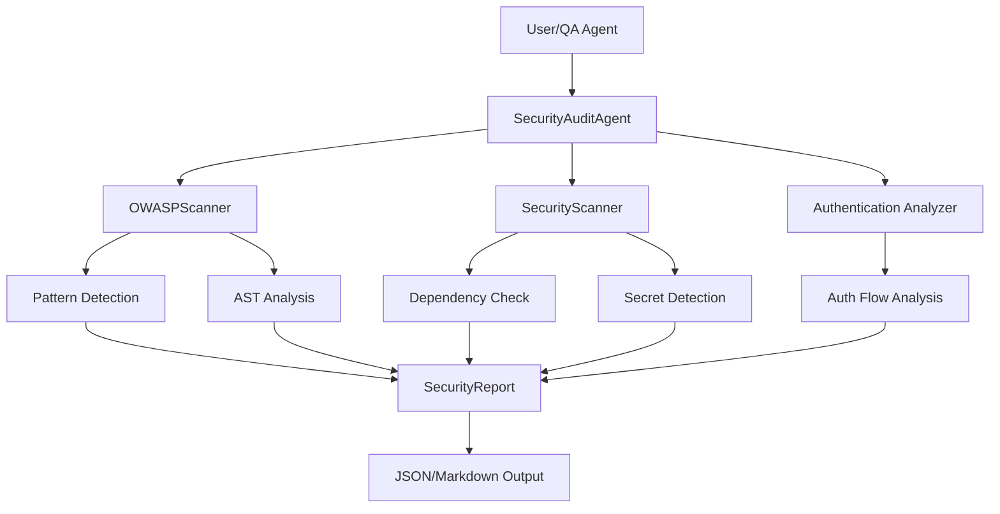

# Security Audit Agent

Specialized agent for comprehensive security analysis. Scans for OWASP Top 10 vulnerabilities, checks dependencies, reviews authentication flows, and generates actionable security reports with remediation guidance.

## Overview

The Security Audit Agent extends Auto Code's security foundation with automated vulnerability detection and reporting. It combines pattern-based analysis with AI-powered review to identify security risks early in development.

**Key capabilities:**
- OWASP Top 10 (2021) vulnerability scanning
- Dependency vulnerability checking
- Secret detection in code
- Authentication flow analysis
- Comprehensive security reports with remediation guidance
- Integration with QA workflow

**Use cases:**
- Automated security audits during development
- Pre-deployment security validation
- Continuous security monitoring
- Security-focused code review

## Architecture

### Components

The Security Audit Agent consists of three main components:

```text
apps/backend/
├── agents/
│   └── security_auditor.py       # Main agent coordinating security scans
├── analysis/
│   └── owasp_scanner.py          # OWASP Top 10 pattern detection
├── cli/
│   └── security_commands.py      # CLI integration
└── prompts/
    └── security_auditor.md       # Agent prompt and workflow
```

**SecurityAuditAgent** (`agents/security_auditor.py`):
- Coordinates all security scanning activities
- Integrates with existing SecurityScanner for dependency and secret detection
- Performs authentication flow analysis
- Generates comprehensive security reports
- Provides remediation guidance with code examples

**OWASPScanner** (`analysis/owasp_scanner.py`):
- Pattern-based detection for all OWASP Top 10 categories
- AST analysis for Python injection vulnerabilities
- Configurable severity levels and detection patterns
- Validates coverage of all OWASP categories

**Security CLI** (`cli/security_commands.py`):
- Command-line interface for security audits
- Multiple output formats (JSON, Markdown)
- Project-wide or spec-specific scanning
- Verbose mode for detailed progress

### Data Flow



## Usage

### CLI Usage

Run a security audit from the command line:

```bash
# Run audit on entire project
python apps/backend/cli/main.py --security-audit

# Audit specific spec (context-aware)
python apps/backend/cli/main.py --security-audit --spec 001

# Generate specific output format
python apps/backend/cli/main.py --security-audit --security-output-format json
python apps/backend/cli/main.py --security-audit --security-output-format markdown
python apps/backend/cli/main.py --security-audit --security-output-format both

# Verbose output
python apps/backend/cli/main.py --security-audit --verbose
```

**CLI Options:**
- `--security-audit` - Run comprehensive security audit
- `--spec XXX` - Audit specific spec directory (optional)
- `--security-output-format FORMAT` - Output format: `json`, `markdown`, or `both` (default: `both`)
- `--verbose` - Enable detailed progress output

### Programmatic Usage

Use the Security Audit Agent in Python code:

```python
from pathlib import Path
from agents.security_auditor import SecurityAuditAgent

# Create agent
auditor = SecurityAuditAgent()

# Run full audit
project_dir = Path("/path/to/project")
spec_dir = Path(".auto-claude/specs/001-feature")

report = auditor.run_full_audit(
    project_dir=project_dir,
    spec_dir=spec_dir  # Optional
)

# Access findings
for finding in report.findings:
    print(f"{finding.severity.upper()}: {finding.title}")
    print(f"  File: {finding.file}:{finding.line}")
    print(f"  Remediation: {finding.remediation}")

# Check summary
print(f"Critical: {report.summary_counts.get('critical', 0)}")
print(f"High: {report.summary_counts.get('high', 0)}")
print(f"Medium: {report.summary_counts.get('medium', 0)}")
print(f"Low: {report.summary_counts.get('low', 0)}")

# Export report
report_json = report.to_dict()
markdown = report.to_markdown()
```

### Integration with QA Workflow

The Security Audit Agent integrates automatically with the QA workflow. QA reviewers run security audits as part of Phase 6.0 validation:

```python
# QA workflow (automated)
# Phase 6.0: Security Audit Validation
from agents.security_auditor import run_security_audit

# Run audit
report = run_security_audit(project_dir, spec_dir)

# Decision rules:
# - Critical/High + exposed endpoints → REJECT
# - Secrets/credentials detected → REJECT
# - Auth vulnerabilities → REJECT
# - Medium/Low only → APPROVE with warnings
```

See `apps/backend/prompts/qa_reviewer.md` for the complete QA security validation workflow.

## OWASP Top 10 Coverage

The scanner detects vulnerabilities across all OWASP Top 10 (2021) categories:

| Category | Name | Detection Methods | Severity |
|----------|------|-------------------|----------|
| **A01** | Broken Access Control | Pattern matching, auth flow analysis | Critical/High |
| **A02** | Cryptographic Failures | Weak crypto detection, plaintext storage | High |
| **A03** | Injection | SQL/NoSQL/command injection patterns, AST analysis | Critical/High |
| **A04** | Insecure Design | Missing validation, unsafe defaults | Medium/High |
| **A05** | Security Misconfiguration | Debug mode, default credentials, exposed configs | Medium/High |
| **A06** | Vulnerable Components | Dependency audit (via SecurityScanner) | Critical-Low |
| **A07** | Auth Failures | Weak auth, missing MFA, session issues | High |
| **A08** | Integrity Failures | Unsigned code, insecure deserialization | High |
| **A09** | Logging Failures | Missing audit logs, log injection | Medium/Low |
| **A10** | SSRF | SSRF patterns, unsafe URL handling | High |

### Validation

Validate OWASP coverage to ensure all categories are checked:

```bash
# Validate coverage (55+ patterns across all 10 categories)
python -c "from analysis.owasp_scanner import validate_owasp_coverage; validate_owasp_coverage()"
```

Coverage validation ensures the scanner maintains comprehensive detection across all OWASP categories.

## Report Generation

### Report Structure

Security reports include:

1. **Executive Summary**
   - Total findings by severity
   - OWASP categories covered
   - High-priority recommendations

2. **Findings**
   - Grouped by severity (Critical → Low → Info)
   - Detailed descriptions with code snippets
   - File locations and line numbers
   - Remediation guidance with examples

3. **OWASP Analysis**
   - Coverage by category
   - Category-specific findings

4. **Authentication Review**
   - Auth flow vulnerabilities
   - Session management issues
   - Authorization weaknesses

5. **Dependency Audit**
   - Known CVEs in dependencies
   - Outdated packages
   - Recommended updates

6. **Recommendations**
   - Prioritized action items
   - Code examples for fixes
   - Security best practices

### Output Formats

**JSON** - Machine-readable for CI/CD integration:

```json
{
  "project_dir": "/path/to/project",
  "timestamp": "2026-02-13T17:30:00Z",
  "findings": [
    {
      "category": "owasp",
      "owasp_category": "A03",
      "severity": "high",
      "title": "SQL Injection Risk",
      "description": "Unsanitized user input in SQL query",
      "file": "app/routes.py",
      "line": 42,
      "code_snippet": "cursor.execute(f\"SELECT * FROM users WHERE id={user_id}\")",
      "remediation": "Use parameterized queries...",
      "cwe": "CWE-89",
      "references": ["https://owasp.org/..."]
    }
  ],
  "summary_counts": {
    "critical": 0,
    "high": 3,
    "medium": 8,
    "low": 5,
    "info": 2
  }
}
```

**Markdown** - Human-readable reports:

````markdown
# Security Audit Report

**Project:** my-project
**Date:** 2026-02-13 17:30:00
**Total Findings:** 18

## Executive Summary

- Critical: 0
- High: 3
- Medium: 8
- Low: 5
- Info: 2

## Findings

### High Severity

#### [A03] SQL Injection Risk
**File:** `app/routes.py:42`
**Severity:** High
**OWASP:** A03 - Injection

**Description:**
Unsanitized user input in SQL query...

**Code:**
```python
cursor.execute(f"SELECT * FROM users WHERE id={user_id}")
```

**Remediation:**
Use parameterized queries to prevent SQL injection...
````

## Configuration

### Environment Variables

Configure security scanning behavior in `apps/backend/.env`:

```bash
# Security scanning settings
SECURITY_SCAN_ENABLED=true
SECURITY_SCAN_EXCLUDE_PATTERNS=tests/*,*.test.js,node_modules/*

# Report settings
SECURITY_REPORT_FORMAT=both  # json, markdown, both
SECURITY_REPORT_DIR=.auto-claude  # or spec_dir if --spec is provided

# Severity thresholds
SECURITY_FAIL_ON_CRITICAL=true
SECURITY_FAIL_ON_HIGH=false
```

### Scan Configuration

Customize scanning behavior in code:

```python
from agents.security_auditor import SecurityAuditAgent

auditor = SecurityAuditAgent()

# Run audit with selected scan types
report = auditor.run_full_audit(
    project_dir=project_dir,
    spec_dir=spec_dir,
    scan_dependencies=True,
    scan_secrets=True,
    analyze_auth=True,
    scan_owasp=True,
)
```

## Examples

### Example 1: Pre-Deployment Security Check

Run security audit before deploying:

```bash
# Run comprehensive audit
python apps/backend/cli/main.py --security-audit --verbose

# Check exit code
if [ $? -eq 0 ]; then
  echo "Security audit passed - deploying"
  ./deploy.sh
else
  echo "Security issues found - deployment blocked"
  exit 1
fi
```

### Example 2: CI/CD Integration

Add to GitHub Actions workflow:

```yaml
name: Security Audit

on: [push, pull_request]

jobs:
  security:
    runs-on: ubuntu-latest
    steps:
      - uses: actions/checkout@v3
      - name: Set up Python
        uses: actions/setup-python@v4
        with:
          python-version: '3.12'
      - name: Install dependencies
        run: |
          cd apps/backend
          uv pip install -r requirements.txt
      - name: Run security audit
        run: |
          python apps/backend/cli/main.py --security-audit --security-output-format json
      - name: Upload report
        uses: actions/upload-artifact@v3
        with:
          name: security-report
          path: .auto-claude/*.json
```

### Example 3: Custom Security Check

Create custom security checks for specific patterns:

```python
from agents.security_auditor import SecurityAuditAgent, SecurityFinding

# Create custom auditor
class CustomSecurityAuditor(SecurityAuditAgent):
    def check_custom_patterns(self, project_dir):
        """Check for project-specific security patterns."""
        findings = []

        # Example: Check for exposed API keys in config
        config_files = project_dir.glob("**/*.config.js")
        for file in config_files:
            content = file.read_text()
            if "apiKey:" in content and "process.env" not in content:
                findings.append(SecurityFinding(
                    category="secret",
                    severity="critical",
                    title="Exposed API Key in Config",
                    description="API key hardcoded in config file",
                    file=str(file),
                    remediation="Move to environment variable"
                ))

        return findings

# Use custom auditor
auditor = CustomSecurityAuditor()
report = auditor.run_full_audit(project_dir)
```

## Development

### Adding New OWASP Patterns

To add detection patterns for new vulnerability types:

1. **Add patterns to `owasp_scanner.py`:**

```python
# In the PATTERNS dict (list of (regex, description) tuples per category)
"A03": [
    # Existing patterns...
    (r"your_new_pattern", "Description of vulnerability detected"),
]
```

1. **Add detection method (if needed):**

```python
def scan_new_vulnerability_type(self, file_path: Path) -> list[OWASPVulnerability]:
    """Scan for new vulnerability type."""
    vulnerabilities = []
    # Detection logic...
    return vulnerabilities
```

1. **Add tests in `tests/test_owasp_scanner.py`:**

```python
def test_detect_new_vulnerability():
    """Test detection of new vulnerability type."""
    code = """
    # Code with vulnerability
    """
    scanner = OWASPScanner()
    result = scanner.scan_new_vulnerability_type(code)
    assert len(result.vulnerabilities) > 0
```

1. **Validate coverage:**

```bash
python -c "from analysis.owasp_scanner import validate_owasp_coverage; validate_owasp_coverage()"
```

### Running Tests

Run the Security Audit Agent test suite:

```bash
# Run all security auditor tests
pytest tests/test_security_auditor.py -v

# Run OWASP scanner tests
pytest tests/test_owasp_scanner.py -v

# Run specific test
pytest tests/test_security_auditor.py::test_run_full_audit -v

# Check test coverage
pytest tests/test_security_auditor.py tests/test_owasp_scanner.py --cov=agents.security_auditor --cov=analysis.owasp_scanner
```

**Test coverage:**
- 45 tests for SecurityAuditAgent
- 54 tests for OWASPScanner
- All OWASP Top 10 categories validated
- Integration tests with existing SecurityScanner

### Extending Remediation Guidance

Add remediation guidance for new vulnerability types:

```python
# In security_auditor.py
def generate_remediation(self, finding: SecurityFinding) -> str:
    """Generate remediation guidance for a finding."""

    # Add new remediation templates
    remediations = {
        "your_vulnerability_type": """
        **Remediation:**
        1. Step 1
        2. Step 2

        **Example:**
        ```python
        # Secure code example
        ```

        **References:**
        - Link 1
        - Link 2
        """,
    }

    return remediations.get(finding.category, "Generic remediation...")
```

## Performance

The Security Audit Agent is optimized for large codebases:

- **Parallel scanning** - File operations run concurrently
- **Pattern caching** - Compiled regex patterns cached for reuse
- **Smart filtering** - Excludes test files, node_modules, and common non-code paths
- **Incremental scanning** - Can scan specific directories or files

**Typical performance:**
- Small project (< 1000 files): fast feedback cycle
- Medium project (1000-5000 files): moderate analysis time
- Large project (> 5000 files): plan for extended analysis

## Security Considerations

**The Security Audit Agent itself:**

- Runs in isolated worktree for spec-based audits
- No external API calls for vulnerability detection (patterns are local)
- Dependency checking uses existing SecurityScanner (respects security policies)
- Report output can contain sensitive code snippets - secure appropriately
- Follows Auto Code's security model (sandbox, permissions, allowlist)

**Best practices:**
- Review reports before sharing (may contain sensitive info)
- Store reports in secure locations (`.auto-claude` is gitignored)
- Use environment variables for security thresholds
- Keep OWASP patterns updated with new vulnerability research

## Troubleshooting

### Common Issues

**Issue: Scanner reports too many false positives**

```python
# Solution: Adjust severity thresholds or add custom exclusions
auditor = SecurityAuditAgent()
auditor.exclude_patterns.append("your/path/to/exclude")
auditor.min_severity = "high"  # Only report high and critical
```

**Issue: Specific file types not scanned**

```python
# Solution: Add extensions to the SCANNABLE_EXTENSIONS constant in owasp_scanner.py
# The scanner uses a module-level frozenset; to add custom extensions,
# create a subclass or modify the constant before scanning:
from analysis.owasp_scanner import SCANNABLE_EXTENSIONS

# Add your extension (requires creating a new frozenset)
custom_extensions = SCANNABLE_EXTENSIONS | frozenset({".your_extension"})
```

**Issue: Missing OWASP category coverage**

```bash
# Validate coverage to identify gaps
python -c "from analysis.owasp_scanner import validate_owasp_coverage; validate_owasp_coverage()"
```

**Issue: Performance slow on large projects**

```python
# Solution: Scan specific directories or use more exclusions
auditor = SecurityAuditAgent()
auditor.exclude_patterns.extend([
    "vendor/**/*",
    "third_party/**/*",
    "generated/**/*"
])
```

## References

- [OWASP Top 10 (2021)](https://owasp.org/Top10/) - Official OWASP Top 10 documentation
- [CWE Database](https://cwe.mitre.org/) - Common Weakness Enumeration
- [apps/backend/agents/security_auditor.py](../apps/backend/agents/security_auditor.py) - SecurityAuditAgent implementation
- [apps/backend/analysis/owasp_scanner.py](../apps/backend/analysis/owasp_scanner.py) - OWASPScanner implementation
- [apps/backend/prompts/security_auditor.md](../apps/backend/prompts/security_auditor.md) - Agent prompt and workflow
- [CLAUDE.md](../CLAUDE.md) - Auto Code architecture overview

---

**Questions or issues?** Open an issue or submit a PR to improve the Security Audit Agent.
